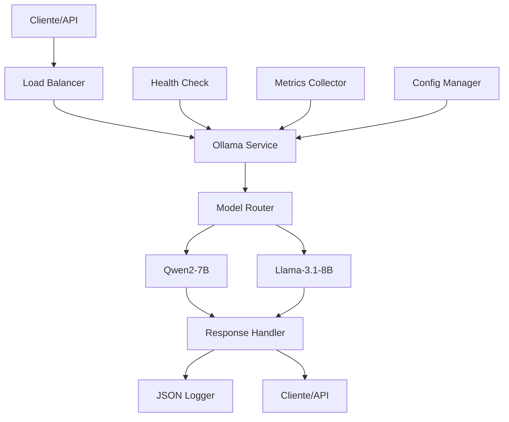

# README_IA-0: Infraestrutura IA — Inferência Local com Ollama

## 1. Objetivo/Contexto

### 🎯 **Objetivo**
Implementar uma infraestrutura de IA local para geração de questões de concursos públicos, utilizando modelos LLM open-source via Ollama, garantindo custos previsíveis e independência de APIs externas.

### 📋 **Contexto do Projeto**
- **Projeto**: Concurso-AI Orchestrated
- **Sprint**: 2 - Camada IA — Infra e Ingestão
- **História**: IA-0 - Infraestrutura IA (Ollama + modelos)
- **Usuário**: Motor de geração de questões
- **Valor**: Custos previsíveis, independência de API externa

### 🏗️ **Arquitetura**


## 2. Como Rodar (Conceitual)

### 🚀 **Pré-requisitos**
- **Python 3.11+** instalado
- **Ollama** instalado e rodando
- **Modelos LLM** configurados (qwen2:7b, llama3.1:8b)
- **Porta 8000** disponível

### 📦 **Instalação**
```bash
# 1. Clonar o repositório
git clone https://github.com/g4trader/concurso-ai-orchestrated.git
cd concurso-ai-orchestrated/ia-0

# 2. Instalar dependências
make install
# ou
pip install -r requirements.txt

# 3. Configurar variáveis de ambiente
cp env.example .env
# Editar .env conforme necessário
```

### 🏃 **Execução**
```bash
# Desenvolvimento
make run
# ou
uvicorn src.main:app --host 0.0.0.0 --port 8000 --reload

# Produção
make run-prod
# ou
gunicorn src.main:app -w 4 -k uvicorn.workers.UvicornWorker --bind 0.0.0.0:8000

# Docker
make docker-build
make docker-run
```

### 🔧 **Configuração do Ollama**
```bash
# 1. Instalar Ollama
curl -fsSL https://ollama.ai/install.sh | sh

# 2. Baixar modelos
ollama pull qwen2:7b
ollama pull llama3.1:8b

# 3. Verificar modelos
ollama list
```

## 3. APIs/Contratos com Exemplos

### 🌐 **Endpoints Disponíveis**

#### **Health Check**
```bash
GET /api/v1/health
```

**Resposta:**
```json
{
  "status": "healthy",
  "ollama_connected": true,
  "models_available": ["qwen2:7b", "llama3.1:8b"],
  "uptime": 3600.5
}
```

#### **Listar Modelos**
```bash
GET /api/v1/models
```

**Resposta:**
```json
[
  {
    "name": "qwen2:7b",
    "size": "4.1GB",
    "modified_at": "2024-01-15T10:30:00Z",
    "digest": "sha256:abc123..."
  }
]
```

#### **Gerar Questão**
```bash
POST /api/v1/generate
Content-Type: application/json

{
  "prompt": "Gere uma questão sobre matemática básica",
  "model": "qwen2:7b",
  "temperature": 0.7,
  "max_tokens": 1000,
  "context": "Concurso público - nível médio"
}
```

**Resposta:**
```json
{
  "question": "Qual é o resultado de 15 + 27?",
  "alternatives": [
    "A) 42",
    "B) 41", 
    "C) 43",
    "D) 40"
  ],
  "correct_answer": "A",
  "explanation": "15 + 27 = 42. A soma de 15 e 27 resulta em 42.",
  "model_used": "qwen2:7b",
  "processing_time": 1.2,
  "timestamp": "2024-01-15T10:30:00Z"
}
```

#### **Gerar em Lote**
```bash
POST /api/v1/generate/batch
Content-Type: application/json

{
  "requests": [
    {
      "prompt": "Questão sobre português",
      "model": "qwen2:7b"
    },
    {
      "prompt": "Questão sobre matemática", 
      "model": "llama3.1:8b"
    }
  ]
}
```

**Resposta:**
```json
{
  "results": [
    {
      "index": 0,
      "success": true,
      "data": {
        "question": "Qual é a regra de concordância verbal?",
        "alternatives": ["A) Sujeito", "B) Predicado", "C) Complemento", "D) Adjunto"],
        "correct_answer": "A",
        "explanation": "O verbo concorda com o sujeito...",
        "model_used": "qwen2:7b",
        "processing_time": 1.1,
        "timestamp": "2024-01-15T10:30:00Z"
      }
    },
    {
      "index": 1,
      "success": true,
      "data": {
        "question": "Quanto é 2 + 2?",
        "alternatives": ["A) 3", "B) 4", "C) 5", "D) 6"],
        "correct_answer": "B",
        "explanation": "2 + 2 = 4",
        "model_used": "llama3.1:8b",
        "processing_time": 0.8,
        "timestamp": "2024-01-15T10:30:00Z"
      }
    }
  ]
}
```

#### **Métricas**
```bash
GET /api/v1/metrics
```

**Resposta:**
```json
{
  "uptime": 3600.5,
  "ollama_host": "http://localhost:11434",
  "default_model": "qwen2:7b",
  "available_models": ["qwen2:7b", "llama3.1:8b"],
  "timestamp": 1705312200.5
}
```

### 📝 **Contratos de Dados**

#### **QuestionRequest**
```json
{
  "prompt": "string (obrigatório)",
  "model": "string (opcional, padrão: qwen2:7b)",
  "max_tokens": "integer (opcional, padrão: 1000)",
  "temperature": "float (opcional, padrão: 0.7)",
  "context": "string (opcional)"
}
```

#### **QuestionResponse**
```json
{
  "question": "string",
  "alternatives": ["string[]"],
  "correct_answer": "string",
  "explanation": "string",
  "model_used": "string",
  "processing_time": "float",
  "timestamp": "datetime"
}
```

#### **ErrorResponse**
```json
{
  "error": "string",
  "details": "object (opcional)",
  "timestamp": "datetime"
}
```

## 4. Variáveis de Ambiente e Logs

### 🔧 **Variáveis de Ambiente**

#### **Ollama Configuration**
```bash
OLLAMA_HOST=http://localhost:11434          # URL do Ollama
OLLAMA_TIMEOUT=30                           # Timeout em segundos
OLLAMA_MAX_RETRIES=3                        # Máximo de tentativas
```

#### **Model Configuration**
```bash
DEFAULT_MODEL=qwen2:7b                      # Modelo padrão
```

#### **API Configuration**
```bash
API_HOST=0.0.0.0                           # Host da API
API_PORT=8000                              # Porta da API
API_RELOAD=true                            # Auto-reload em desenvolvimento
```

#### **Logging**
```bash
LOG_LEVEL=INFO                             # Nível de log (DEBUG, INFO, WARNING, ERROR)
```

#### **CORS**
```bash
CORS_ORIGINS=http://localhost:3000,http://localhost:8080,https://vercel.app
```

### 📊 **Sistema de Logs**

#### **Formato de Log**
```json
{
  "timestamp": "2024-01-15T10:30:00.123Z",
  "level": "INFO",
  "logger": "ollama_service",
  "message": "Question generated successfully",
  "request_id": "req_123456",
  "model": "qwen2:7b",
  "processing_time": 1.2,
  "tokens_used": 150
}
```

#### **Níveis de Log**
- **DEBUG**: Informações detalhadas para debugging
- **INFO**: Informações gerais de operação
- **WARNING**: Avisos sobre situações anômalas
- **ERROR**: Erros que não impedem o funcionamento
- **CRITICAL**: Erros críticos que impedem o funcionamento

#### **Estrutura de Logs**
```
2024-01-15 10:30:00 [INFO] Starting IA-0 Ollama Service
2024-01-15 10:30:01 [INFO] Connected to Ollama at http://localhost:11434
2024-01-15 10:30:01 [INFO] Available models: ['qwen2:7b', 'llama3.1:8b']
2024-01-15 10:30:15 [INFO] Question generated successfully - model: qwen2:7b, time: 1.2s
2024-01-15 10:30:20 [WARNING] Model llama3.1:8b not responding, using fallback
2024-01-15 10:30:25 [ERROR] Ollama connection failed - retrying in 5s
```

## 5. Limitações e Próximos Passos

### ⚠️ **Limitações Conhecidas**

#### **Técnicas**
- **Dependência do Ollama**: Requer Ollama rodando localmente
- **Modelos pré-carregados**: Modelos devem estar baixados e disponíveis
- **Timeout fixo**: 30 segundos para requisições (não configurável por request)
- **Máximo de tokens**: 1000 tokens por geração (limitação do modelo)
- **Concorrência limitada**: Performance degrada com muitas requisições simultâneas

#### **Operacionais**
- **Recursos de hardware**: Requer GPU ou CPU potente para performance adequada
- **Memória**: Modelos consomem 4-8GB de RAM cada
- **Rede local**: Não funciona sem acesso à rede local do Ollama
- **Monitoramento**: Métricas básicas, sem alertas automáticos

#### **Funcionais**
- **Formato fixo**: Questões sempre em formato de múltipla escolha
- **Idioma**: Otimizado para português brasileiro
- **Contexto limitado**: Não mantém contexto entre requisições
- **Validação básica**: Validação mínima de qualidade das questões geradas

### 🚀 **Próximos Passos**

#### **Sprint 3 - Melhorias de Performance**
- **Cache de respostas**: Implementar cache para prompts similares
- **Pool de conexões**: Pool de conexões HTTP para Ollama
- **Load balancing**: Distribuição de carga entre modelos
- **Métricas avançadas**: Prometheus + Grafana para monitoramento

#### **Sprint 4 - Funcionalidades Avançadas**
- **Streaming**: Suporte a streaming de respostas
- **Contexto persistente**: Manter contexto entre requisições
- **Validação de qualidade**: Sistema de validação automática de questões
- **Múltiplos formatos**: Suporte a diferentes tipos de questão

#### **Sprint 5 - Escalabilidade**
- **Kubernetes**: Deploy em cluster Kubernetes
- **Auto-scaling**: Escalamento automático baseado em demanda
- **Multi-region**: Deploy em múltiplas regiões
- **CDN**: Cache de respostas em CDN

#### **Sprint 6 - Inteligência**
- **Fine-tuning**: Fine-tuning de modelos para concursos específicos
- **A/B testing**: Teste de diferentes modelos e parâmetros
- **Feedback loop**: Sistema de feedback para melhorar qualidade
- **Analytics**: Analytics avançados de uso e performance

### 📈 **Métricas de Sucesso**

#### **Performance**
- **Latência**: <5s para geração de questão
- **Throughput**: >10 questões/minuto
- **Disponibilidade**: >99% uptime
- **Tempo de resposta**: <1s para health check

#### **Qualidade**
- **Taxa de sucesso**: >95% de requisições bem-sucedidas
- **Qualidade das questões**: >80% de questões válidas
- **Cobertura de testes**: >85% de cobertura de código
- **Satisfação do usuário**: >4.0/5.0 em avaliações

#### **Operacionais**
- **Deploy time**: <5 minutos para deploy
- **Recovery time**: <2 minutos para recuperação de falhas
- **Resource usage**: <80% de CPU e memória
- **Error rate**: <1% de taxa de erro

### 🔄 **Ciclo de Melhoria Contínua**

#### **Monitoramento**
- **Logs estruturados**: Análise de logs para identificar padrões
- **Métricas em tempo real**: Dashboard de métricas operacionais
- **Alertas proativos**: Alertas para degradação de performance
- **Health checks**: Verificação contínua de saúde do sistema

#### **Feedback**
- **User feedback**: Coleta de feedback dos usuários
- **Performance metrics**: Análise de métricas de performance
- **Error analysis**: Análise de erros para melhorias
- **A/B testing**: Testes de diferentes abordagens

#### **Iteração**
- **Sprints regulares**: Melhorias incrementais a cada sprint
- **Retrospectivas**: Análise de lições aprendidas
- **Priorização**: Priorização baseada em impacto e esforço
- **Documentação**: Atualização contínua da documentação

---

**Este documento fornece uma visão completa da infraestrutura IA-0, incluindo objetivos, arquitetura, APIs, configurações, limitações e roadmap para evolução contínua do sistema.**
