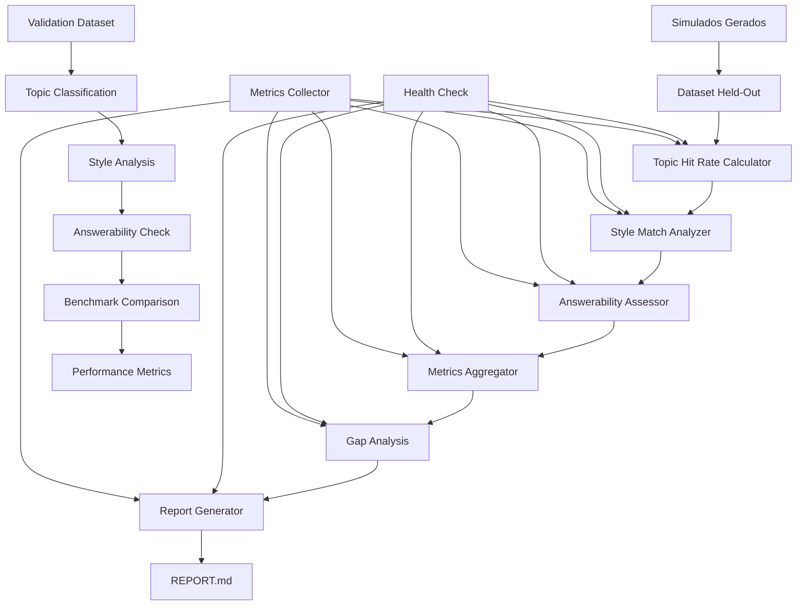

# ARCH_IA-3: Avaliação Offline — Topic-Hit Rate, Style Match, Answerability

## 1. Diagrama (entrada→processamento→saída)



## 2. Pastas/arquivos a criar

```
/ia-3/
├── src/
│   ├── __init__.py
│   ├── main.py
│   ├── config/
│   │   ├── __init__.py
│   │   ├── settings.py
│   │   └── models.py
│   ├── services/
│   │   ├── __init__.py
│   │   ├── topic_hit_rate_service.py
│   │   ├── style_match_service.py
│   │   ├── answerability_service.py
│   │   ├── metrics_aggregator_service.py
│   │   ├── gap_analysis_service.py
│   │   ├── report_generator_service.py
│   │   └── benchmark_service.py
│   ├── api/
│   │   ├── __init__.py
│   │   ├── routes.py
│   │   └── middleware.py
│   ├── utils/
│   │   ├── __init__.py
│   │   ├── logger.py
│   │   ├── metrics.py
│   │   └── data_utils.py
│   ├── models/
│   │   ├── __init__.py
│   │   ├── request.py
│   │   ├── response.py
│   │   └── evaluation.py
│   └── evaluators/
│       ├── __init__.py
│       ├── topic_evaluator.py
│       ├── style_evaluator.py
│       └── answerability_evaluator.py
├── tests/
│   ├── __init__.py
│   ├── test_topic_hit_rate_service.py
│   ├── test_style_match_service.py
│   ├── test_answerability_service.py
│   ├── test_metrics_aggregator_service.py
│   ├── test_gap_analysis_service.py
│   ├── test_report_generator_service.py
│   └── test_benchmark_service.py
├── data/
│   ├── held_out/
│   │   ├── cespe_2023.json
│   │   ├── fgv_2023.json
│   │   └── vunesp_2023.json
│   ├── generated/
│   │   ├── simulados_cespe_2023.json
│   │   ├── simulados_fgv_2023.json
│   │   └── simulados_vunesp_2023.json
│   └── benchmarks/
│       ├── topic_classification.json
│       ├── style_patterns.json
│       └── answerability_criteria.json
├── reports/
│   ├── evaluation_report.md
│   ├── gap_analysis.md
│   └── recommendations.md
├── docker/
│   ├── Dockerfile
│   └── docker-compose.yml
├── docs/
│   ├── API.md
│   └── DEPLOYMENT.md
├── requirements.txt
├── Makefile
├── .env.example
└── README.md
```

## 3. Contratos (schemas/DTOs) com exemplos

### Evaluation Request
```json
{
  "evaluation_id": "eval_123456",
  "generated_simulados": [
    {
      "simulado_id": "sim_001",
      "banca": "CESPE",
      "ano": 2023,
      "topico": "Direito Constitucional",
      "questoes": [
        {
          "questao_id": "q_001",
          "pergunta": "Qual é o princípio fundamental da Constituição Federal?",
          "alternativas": {
            "A": "Princípio da legalidade",
            "B": "Princípio da separação dos poderes",
            "C": "Princípio da igualdade"
          },
          "resposta_correta": "B",
          "justificativa": "O princípio da separação dos poderes..."
        }
      ]
    }
  ],
  "held_out_dataset": {
    "banca": "CESPE",
    "ano": 2023,
    "topico": "Direito Constitucional",
    "questoes_reais": [
      {
        "questao_id": "real_001",
        "pergunta": "Sobre os princípios fundamentais...",
        "alternativas": {...},
        "resposta_correta": "B"
      }
    ]
  },
  "evaluation_config": {
    "metrics": ["topic_hit_rate", "style_match", "answerability"],
    "thresholds": {
      "topic_hit_rate": 0.8,
      "style_match": 0.7,
      "answerability": 0.9
    }
  }
}
```

### Evaluation Response
```json
{
  "evaluation_id": "eval_123456",
  "status": "completed",
  "metrics": {
    "topic_hit_rate": {
      "score": 0.85,
      "details": {
        "total_questions": 100,
        "topic_matches": 85,
        "topic_miss": 15,
        "breakdown": {
          "Direito Constitucional": 0.90,
          "Direito Administrativo": 0.80,
          "Direito Penal": 0.85
        }
      }
    },
    "style_match": {
      "score": 0.75,
      "details": {
        "total_questions": 100,
        "style_matches": 75,
        "style_miss": 25,
        "breakdown": {
          "linguagem_formal": 0.80,
          "estrutura_questao": 0.70,
          "nivel_dificuldade": 0.75
        }
      }
    },
    "answerability": {
      "score": 0.92,
      "details": {
        "total_questions": 100,
        "answerable": 92,
        "unanswerable": 8,
        "breakdown": {
          "clareza_pergunta": 0.95,
          "alternativas_validas": 0.90,
          "justificativa_coerente": 0.90
        }
      }
    }
  },
  "gap_analysis": {
    "critical_gaps": [
      {
        "gap_type": "topic_coverage",
        "description": "Baixa cobertura em Direito Tributário",
        "impact": "high",
        "recommendation": "Aumentar contextos de Direito Tributário"
      }
    ],
    "moderate_gaps": [
      {
        "gap_type": "style_consistency",
        "description": "Inconsistência no nível de formalidade",
        "impact": "medium",
        "recommendation": "Refinar prompts de estilo"
      }
    ]
  },
  "recommendations": [
    "Aumentar diversidade de tópicos no dataset de treinamento",
    "Melhorar consistência de estilo entre questões",
    "Implementar validação de answerability mais rigorosa"
  ],
  "processing_time": 45.2,
  "timestamp": "2024-01-15T10:30:00Z"
}
```

### Benchmark Request
```json
{
  "benchmark_id": "bench_789012",
  "evaluation_requests": [
    {
      "evaluation_id": "eval_001",
      "generated_simulados": [...],
      "held_out_dataset": {...}
    }
  ],
  "benchmark_config": {
    "metrics": ["topic_hit_rate", "style_match", "answerability"],
    "aggregation_method": "weighted_average",
    "weights": {
      "topic_hit_rate": 0.4,
      "style_match": 0.3,
      "answerability": 0.3
    }
  }
}
```

### Benchmark Response
```json
{
  "benchmark_id": "bench_789012",
  "status": "completed",
  "overall_score": 0.84,
  "evaluations": [
    {
      "evaluation_id": "eval_001",
      "metrics": {...},
      "score": 0.85
    }
  ],
  "aggregated_metrics": {
    "topic_hit_rate": 0.85,
    "style_match": 0.75,
    "answerability": 0.92
  },
  "performance_trends": {
    "improvement_rate": 0.05,
    "consistency_score": 0.88,
    "reliability_score": 0.90
  },
  "processing_time": 120.5,
  "timestamp": "2024-01-15T10:30:00Z"
}
```

### Report Request
```json
{
  "report_id": "report_345678",
  "evaluation_results": [...],
  "benchmark_results": [...],
  "report_config": {
    "format": "markdown",
    "include_charts": true,
    "include_recommendations": true,
    "include_gap_analysis": true
  }
}
```

### Report Response
```json
{
  "report_id": "report_345678",
  "status": "generated",
  "report_path": "/reports/evaluation_report_2024-01-15.md",
  "sections": [
    "executive_summary",
    "metrics_analysis",
    "gap_analysis",
    "recommendations",
    "appendix"
  ],
  "generation_time": 15.3,
  "timestamp": "2024-01-15T10:30:00Z"
}
```

### Health Check Response
```json
{
  "status": "healthy",
  "services": {
    "topic_hit_rate": {
      "status": "healthy",
      "response_time": 2.1,
      "evaluations_performed": 150
    },
    "style_match": {
      "status": "healthy",
      "response_time": 1.8,
      "evaluations_performed": 150
    },
    "answerability": {
      "status": "healthy",
      "response_time": 1.5,
      "evaluations_performed": 150
    },
    "metrics_aggregator": {
      "status": "healthy",
      "response_time": 0.5,
      "aggregations_performed": 50
    },
    "gap_analysis": {
      "status": "healthy",
      "response_time": 3.2,
      "analyses_performed": 50
    },
    "report_generator": {
      "status": "healthy",
      "response_time": 15.3,
      "reports_generated": 10
    }
  },
  "uptime": 3600.5,
  "timestamp": "2024-01-15T10:30:00Z"
}
```

## 4. Decisões/Trade-offs

### **Topic Hit Rate**
- **Classificação automática vs Manual**: Classificação automática para escalabilidade
- **Trade-off**: Precisão vs Velocidade
- **Decisão**: Classificação automática com validação manual de amostras

### **Style Match**
- **Análise heurística vs ML**: Análise heurística para simplicidade
- **Trade-off**: Precisão vs Complexidade
- **Decisão**: Análise heurística com regras configuráveis

### **Answerability**
- **Validação automática vs Manual**: Validação automática para consistência
- **Trade-off**: Precisão vs Velocidade
- **Decisão**: Validação automática com threshold configurável

### **Dataset Held-Out**
- **Provas antigas vs Simuladas**: Provas antigas para validação real
- **Trade-off**: Disponibilidade vs Qualidade
- **Decisão**: Provas antigas com fallback para simuladas

### **Métricas**
- **Métricas simples vs Complexas**: Métricas simples para clareza
- **Trade-off**: Precisão vs Interpretabilidade
- **Decisão**: Métricas simples com breakdown detalhado

### **Relatórios**
- **Markdown vs PDF**: Markdown para simplicidade
- **Trade-off**: Formatação vs Simplicidade
- **Decisão**: Markdown com opção de conversão para PDF

### **Benchmark**
- **Comparação absoluta vs Relativa**: Comparação relativa para contexto
- **Trade-off**: Precisão vs Interpretabilidade
- **Decisão**: Comparação relativa com baseline

## 5. Checklist por etapas (P/M/G) e Riscos & Mitigações

### **Topic Hit Rate Service (M)**
- [ ] Implementar classificação de tópicos
- [ ] Adicionar validação de classificação
- [ ] Implementar cálculo de hit rate
- [ ] Adicionar breakdown por tópico
- [ ] Implementar logs estruturados

**Riscos:**
- **Classificação incorreta**: Validação manual de amostras
- **Tópicos não cobertos**: Fallback para classificação genérica
- **Performance lenta**: Cache de classificações

**Mitigações:**
- Validação manual de amostras
- Classificação genérica como fallback
- Cache de classificações

### **Style Match Service (M)**
- [ ] Implementar análise heurística
- [ ] Adicionar regras de estilo configuráveis
- [ ] Implementar cálculo de match
- [ ] Adicionar breakdown por aspecto
- [ ] Implementar logs estruturados

**Riscos:**
- **Regras inadequadas**: Regras configuráveis
- **Análise subjetiva**: Múltiplas validações
- **Performance lenta**: Cache de análises

**Mitigações:**
- Regras configuráveis
- Múltiplas validações
- Cache de análises

### **Answerability Service (P)**
- [ ] Implementar validação automática
- [ ] Adicionar threshold configurável
- [ ] Implementar cálculo de answerability
- [ ] Adicionar breakdown por critério
- [ ] Implementar logs estruturados

**Riscos:**
- **Validação incorreta**: Threshold configurável
- **Critérios inadequados**: Critérios configuráveis
- **Performance lenta**: Cache de validações

**Mitigações:**
- Threshold configurável
- Critérios configuráveis
- Cache de validações

### **Metrics Aggregator Service (P)**
- [ ] Implementar agregação de métricas
- [ ] Adicionar pesos configuráveis
- [ ] Implementar cálculo de score geral
- [ ] Adicionar breakdown detalhado
- [ ] Implementar logs estruturados

**Riscos:**
- **Agregação incorreta**: Validação de pesos
- **Pesos inadequados**: Pesos configuráveis
- **Performance lenta**: Cache de agregações

**Mitigações:**
- Validação de pesos
- Pesos configuráveis
- Cache de agregações

### **Gap Analysis Service (G)**
- [ ] Implementar análise de gaps
- [ ] Adicionar classificação de impacto
- [ ] Implementar geração de recomendações
- [ ] Adicionar priorização de gaps
- [ ] Implementar logs estruturados

**Riscos:**
- **Análise incorreta**: Validação manual
- **Recomendações inadequadas**: Template de recomendações
- **Performance lenta**: Cache de análises

**Mitigações:**
- Validação manual
- Template de recomendações
- Cache de análises

### **Report Generator Service (G)**
- [ ] Implementar geração de relatórios
- [ ] Adicionar templates configuráveis
- [ ] Implementar formatação Markdown
- [ ] Adicionar gráficos e tabelas
- [ ] Implementar logs estruturados

**Riscos:**
- **Relatório incorreto**: Validação de template
- **Formatação inadequada**: Template configurável
- **Performance lenta**: Cache de relatórios

**Mitigações:**
- Validação de template
- Template configurável
- Cache de relatórios

### **Benchmark Service (G)**
- [ ] Implementar benchmark automático
- [ ] Adicionar comparação com baseline
- [ ] Implementar cálculo de tendências
- [ ] Adicionar métricas de performance
- [ ] Implementar logs estruturados

**Riscos:**
- **Benchmark incorreto**: Validação de baseline
- **Comparação inadequada**: Baseline configurável
- **Performance lenta**: Cache de benchmarks

**Mitigações:**
- Validação de baseline
- Baseline configurável
- Cache de benchmarks

### **API Layer (P)**
- [ ] Implementar endpoints REST
- [ ] Adicionar validação de input
- [ ] Implementar rate limiting
- [ ] Adicionar autenticação
- [ ] Implementar documentação

**Riscos:**
- **Sobrecarga da API**: Rate limiting
- **Segurança**: Autenticação obrigatória
- **Usabilidade**: Documentação completa

**Mitigações:**
- Rate limiting por IP
- Autenticação JWT
- Documentação OpenAPI

### **Monitoring & Logging (P)**
- [ ] Implementar logs estruturados
- [ ] Adicionar métricas Prometheus
- [ ] Implementar health checks
- [ ] Adicionar alertas
- [ ] Implementar dashboard

**Riscos:**
- **Falhas silenciosas**: Alertas proativos
- **Debugging difícil**: Logs estruturados
- **Performance não monitorada**: Métricas em tempo real

**Mitigações:**
- Alertas proativos
- Logs estruturados
- Métricas em tempo real
- Dashboard de monitoramento

---

**Este documento define a arquitetura completa do sistema de avaliação offline IA-3, incluindo decisões técnicas, trade-offs e plano de implementação com mitigação de riscos.**
