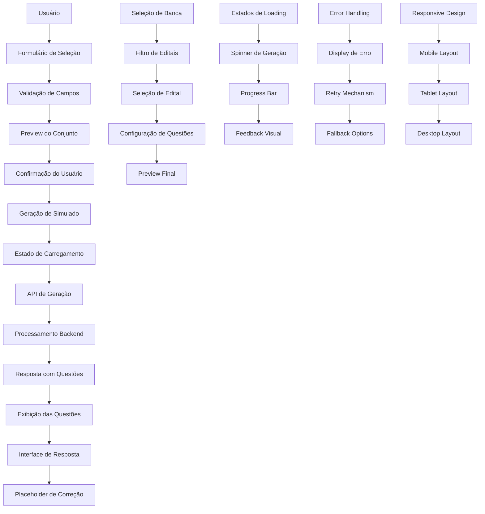

# ARCH_WEB-003: Tela de Geração de Simulado

## 1. Diagrama (entrada→processamento→saída)



## 2. Pastas/arquivos a criar

```
/web-003/
├── src/
│   ├── components/
│   │   ├── simulado/
│   │   │   ├── simulado-form.tsx
│   │   │   ├── banca-selector.tsx
│   │   │   ├── edital-selector.tsx
│   │   │   ├── question-config.tsx
│   │   │   ├── simulado-preview.tsx
│   │   │   ├── generation-progress.tsx
│   │   │   ├── question-display.tsx
│   │   │   ├── answer-input.tsx
│   │   │   └── simulado-navigation.tsx
│   │   ├── ui/
│   │   │   ├── button.tsx
│   │   │   ├── input.tsx
│   │   │   ├── select.tsx
│   │   │   ├── card.tsx
│   │   │   ├── modal.tsx
│   │   │   ├── spinner.tsx
│   │   │   ├── progress-bar.tsx
│   │   │   ├── alert.tsx
│   │   │   └── badge.tsx
│   │   └── layout/
│   │       ├── header.tsx
│   │       ├── sidebar.tsx
│   │       └── footer.tsx
│   ├── hooks/
│   │   ├── use-simulado.ts
│   │   │   ├── use-simulado-generation.ts
│   │   │   ├── use-simulado-state.ts
│   │   │   └── use-simulado-navigation.ts
│   │   ├── use-banca.ts
│   │   ├── use-edital.ts
│   │   └── use-questions.ts
│   ├── services/
│   │   ├── simulado-service.ts
│   │   ├── banca-service.ts
│   │   ├── edital-service.ts
│   │   ├── question-service.ts
│   │   └── generation-service.ts
│   ├── utils/
│   │   ├── validation.ts
│   │   ├── constants.ts
│   │   ├── helpers.ts
│   │   ├── formatters.ts
│   │   └── errors.ts
│   ├── types/
│   │   ├── simulado.ts
│   │   ├── banca.ts
│   │   ├── edital.ts
│   │   ├── question.ts
│   │   └── generation.ts
│   ├── pages/
│   │   ├── simulado/
│   │   │   ├── generate/
│   │   │   │   ├── index.tsx
│   │   │   │   └── loading.tsx
│   │   │   ├── take/
│   │   │   │   ├── [id]/
│   │   │   │   │   ├── index.tsx
│   │   │   │   │   └── loading.tsx
│   │   │   │   └── loading.tsx
│   │   │   └── results/
│   │   │       ├── [id]/
│   │   │       │   ├── index.tsx
│   │   │       │   └── loading.tsx
│   │   │       └── loading.tsx
│   │   └── _app.tsx
│   └── contexts/
│       ├── simulado-context.tsx
│       └── simulado-provider.tsx
├── tests/
│   ├── components/
│   │   ├── simulado/
│   │   │   ├── simulado-form.test.tsx
│   │   │   ├── banca-selector.test.tsx
│   │   │   ├── edital-selector.test.tsx
│   │   │   ├── question-config.test.tsx
│   │   │   ├── simulado-preview.test.tsx
│   │   │   ├── generation-progress.test.tsx
│   │   │   ├── question-display.test.tsx
│   │   │   └── answer-input.test.tsx
│   │   └── ui/
│   │       ├── select.test.tsx
│   │       ├── progress-bar.test.tsx
│   │       └── badge.test.tsx
│   ├── hooks/
│   │   ├── use-simulado.test.ts
│   │   ├── use-banca.test.ts
│   │   ├── use-edital.test.ts
│   │   └── use-questions.test.ts
│   ├── services/
│   │   ├── simulado-service.test.ts
│   │   ├── banca-service.test.ts
│   │   ├── edital-service.test.ts
│   │   └── question-service.test.ts
│   └── utils/
│       ├── validation.test.ts
│       ├── formatters.test.ts
│       └── helpers.test.ts
├── docs/
│   ├── SIMULADO_FLOW.md
│   ├── API_CONTRACTS.md
│   └── UX_GUIDELINES.md
├── .env.example
├── package.json
└── README.md
```

## 3. Contratos (schemas/DTOs) com exemplos

### Simulado Types
```typescript
// types/simulado.ts
export interface Simulado {
  id: string;
  title: string;
  description: string;
  banca: Banca;
  edital: Edital;
  totalQuestions: number;
  timeLimit: number; // em minutos
  difficulty: 'easy' | 'medium' | 'hard';
  topics: string[];
  createdAt: string;
  status: 'draft' | 'generating' | 'ready' | 'in_progress' | 'completed' | 'expired';
  userId: string;
}

export interface SimuladoGenerationRequest {
  bancaId: string;
  editalId: string;
  totalQuestions: number;
  timeLimit: number;
  difficulty: 'easy' | 'medium' | 'hard';
  topics: string[];
  customInstructions?: string;
}

export interface SimuladoGenerationResponse {
  simulado: Simulado;
  questions: Question[];
  estimatedTime: number;
  generationId: string;
}

export interface SimuladoPreview {
  banca: Banca;
  edital: Edital;
  totalQuestions: number;
  timeLimit: number;
  difficulty: 'easy' | 'medium' | 'hard';
  topics: string[];
  estimatedTime: number;
  availableQuestions: number;
}
```

### Banca Types
```typescript
// types/banca.ts
export interface Banca {
  id: string;
  name: string;
  code: string;
  description: string;
  logo?: string;
  website?: string;
  isActive: boolean;
  characteristics: BancaCharacteristics;
  createdAt: string;
  updatedAt: string;
}

export interface BancaCharacteristics {
  questionStyle: 'multiple_choice' | 'true_false' | 'mixed';
  answerFormat: 'A-E' | 'A-D' | 'A-C' | 'V-F';
  timePerQuestion: number; // em minutos
  difficultyDistribution: {
    easy: number;
    medium: number;
    hard: number;
  };
  commonTopics: string[];
  specialInstructions?: string;
}

export interface BancaListResponse {
  bancas: Banca[];
  total: number;
  page: number;
  limit: number;
}
```

### Edital Types
```typescript
// types/edital.ts
export interface Edital {
  id: string;
  title: string;
  description: string;
  bancaId: string;
  year: number;
  month?: number;
  examType: 'concurso' | 'vestibular' | 'enem' | 'outro';
  subjects: string[];
  totalQuestions: number;
  timeLimit: number;
  isActive: boolean;
  publishedAt: string;
  examDate?: string;
  createdAt: string;
  updatedAt: string;
}

export interface EditalListResponse {
  editais: Edital[];
  total: number;
  page: number;
  limit: number;
}

export interface EditalFilter {
  bancaId?: string;
  year?: number;
  examType?: string;
  subjects?: string[];
  isActive?: boolean;
}
```

### Question Types
```typescript
// types/question.ts
export interface Question {
  id: string;
  simuladoId: string;
  question: string;
  alternatives: {
    A: string;
    B: string;
    C: string;
    D: string;
    E: string;
  };
  correctAnswer: 'A' | 'B' | 'C' | 'D' | 'E';
  explanation?: string;
  difficulty: 'easy' | 'medium' | 'hard';
  topic: string;
  subtopic?: string;
  source?: string;
  year?: number;
  banca?: string;
  estimatedTime: number; // em minutos
  order: number;
  createdAt: string;
}

export interface QuestionResponse {
  questionId: string;
  selectedAnswer: 'A' | 'B' | 'C' | 'D' | 'E';
  timeSpent: number; // em segundos
  isCorrect: boolean;
  answeredAt: string;
}

export interface QuestionListResponse {
  questions: Question[];
  total: number;
  page: number;
  limit: number;
}
```

### Generation Types
```typescript
// types/generation.ts
export interface GenerationStatus {
  id: string;
  status: 'pending' | 'processing' | 'completed' | 'failed';
  progress: number; // 0-100
  currentStep: string;
  estimatedTimeRemaining: number; // em segundos
  error?: string;
  createdAt: string;
  updatedAt: string;
}

export interface GenerationRequest {
  bancaId: string;
  editalId: string;
  totalQuestions: number;
  timeLimit: number;
  difficulty: 'easy' | 'medium' | 'hard';
  topics: string[];
  customInstructions?: string;
}

export interface GenerationResponse {
  generationId: string;
  status: GenerationStatus;
  simulado?: Simulado;
  questions?: Question[];
}
```

## 4. Decisões/Trade-offs

### **Geração de Simulados**
- **Síncrona vs Assíncrona**: Geração assíncrona para melhor UX
- **Trade-off**: Complexidade vs Performance
- **Decisão**: Geração assíncrona com polling para status

### **Armazenamento de Estado**
- **Local vs Global**: Estado global para simulado em progresso
- **Trade-off**: Simplicidade vs Escalabilidade
- **Decisão**: Context global com persistência local

### **Validação**
- **Frontend vs Backend**: Validação dupla para UX e segurança
- **Trade-off**: Performance vs Robustez
- **Decisão**: Validação frontend para UX, backend para segurança

### **Error Handling**
- **Global vs Component**: Error boundary global com tratamento local
- **Trade-off**: Consistência vs Flexibilidade
- **Decisão**: Error boundary global com tratamento específico

### **Loading States**
- **Skeleton vs Spinner**: Skeleton para melhor UX
- **Trade-off**: Complexidade vs UX
- **Decisão**: Skeleton para conteúdo, spinner para ações

### **Responsividade**
- **Mobile-first vs Desktop-first**: Mobile-first para acessibilidade
- **Trade-off**: Desenvolvimento vs Acessibilidade
- **Decisão**: Mobile-first com breakpoints específicos

### **Navegação**
- **SPA vs MPA**: SPA para melhor UX
- **Trade-off**: SEO vs Performance
- **Decisão**: SPA com Next.js para balance

### **Performance**
- **Lazy Loading vs Eager Loading**: Lazy loading para otimização
- **Trade-off**: Complexidade vs Performance
- **Decisão**: Lazy loading para componentes pesados

## 5. Checklist por etapas (P/M/G) e Riscos & Mitigações

### **Setup Inicial (P)**
- [ ] Configurar estrutura de pastas
- [ ] Configurar TypeScript types
- [ ] Configurar constantes de simulado
- [ ] Configurar variáveis de ambiente

**Riscos:**
- **Configuração complexa**: Documentação clara e scripts
- **Dependências conflitantes**: Lock de versões

**Mitigações:**
- Documentação passo-a-passo
- Scripts de setup automatizados
- Testes de configuração

### **Formulário de Seleção (P)**
- [ ] Implementar SimuladoForm
- [ ] Implementar BancaSelector
- [ ] Implementar EditalSelector
- [ ] Implementar QuestionConfig
- [ ] Implementar validação

**Riscos:**
- **Validação inadequada**: Validação dupla
- **UX confusa**: Feedback claro

**Mitigações:**
- Validação frontend/backend
- Mensagens de erro claras
- Loading states visuais

### **Preview do Conjunto (M)**
- [ ] Implementar SimuladoPreview
- [ ] Implementar preview de questões
- [ ] Implementar estimativa de tempo
- [ ] Implementar confirmação

**Riscos:**
- **Preview impreciso**: Validação rigorosa
- **UX confusa**: Preview claro

**Mitigações:**
- Validação de dados
- Preview visual claro
- Confirmação obrigatória

### **Geração de Simulado (M)**
- [ ] Implementar GenerationService
- [ ] Implementar polling de status
- [ ] Implementar progress tracking
- [ ] Implementar error handling

**Riscos:**
- **Geração falha**: Fallback para retry
- **Timeout**: Timeout adequado

**Mitigações:**
- Retry automático
- Timeout configurável
- Error handling robusto

### **Exibição de Questões (M)**
- [ ] Implementar QuestionDisplay
- [ ] Implementar AnswerInput
- [ ] Implementar SimuladoNavigation
- [ ] Implementar timer

**Riscos:**
- **Performance lenta**: Lazy loading
- **UX confusa**: Navegação clara

**Mitigações:**
- Lazy loading de questões
- Navegação intuitiva
- Timer visível

### **Estados de Loading (G)**
- [ ] Implementar GenerationProgress
- [ ] Implementar skeleton loading
- [ ] Implementar progress bar
- [ ] Implementar feedback visual

**Riscos:**
- **Loading confuso**: Feedback claro
- **Performance**: Loading otimizado

**Mitigações:**
- Feedback visual claro
- Loading otimizado
- Progress tracking

### **Error Handling (G)**
- [ ] Implementar error boundaries
- [ ] Implementar error types
- [ ] Implementar error messages
- [ ] Implementar error recovery

**Riscos:**
- **Erros não tratados**: Error boundaries
- **UX ruim**: Mensagens claras

**Mitigações:**
- Error boundaries globais
- Mensagens de erro claras
- Recovery automático

### **Responsividade (G)**
- [ ] Implementar mobile layout
- [ ] Implementar tablet layout
- [ ] Implementar desktop layout
- [ ] Implementar breakpoints

**Riscos:**
- **Layout quebrado**: Testes em múltiplos dispositivos
- **Performance**: Layout otimizado

**Mitigações:**
- Testes de responsividade
- Layout otimizado
- Breakpoints adequados

### **Testing (G)**
- [ ] Implementar testes unitários
- [ ] Implementar testes de integração
- [ ] Implementar testes E2E
- [ ] Implementar mocks

**Riscos:**
- **Cobertura baixa**: Metas de cobertura
- **Testes lentos**: Otimização

**Mitigações:**
- Coverage thresholds
- Test optimization
- CI/CD integration

### **Performance (G)**
- [ ] Implementar lazy loading
- [ ] Implementar code splitting
- [ ] Implementar caching
- [ ] Implementar optimization

**Riscos:**
- **Performance lenta**: Otimizações
- **Bundle size**: Code splitting

**Mitigações:**
- Lazy loading
- Code splitting
- Bundle optimization

---

**Este documento define a arquitetura completa da tela de geração de simulado WEB-003, incluindo estrutura, contratos, decisões técnicas e plano de implementação com mitigação de riscos.**
