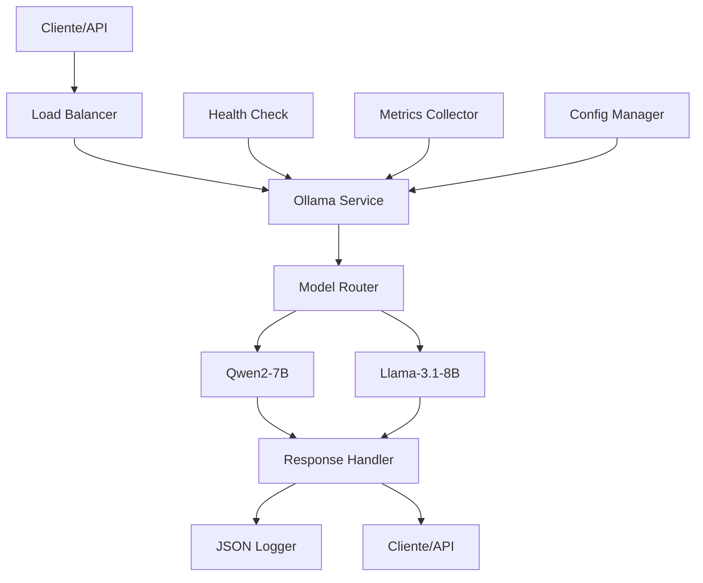

# ARCH_IA-0: Infraestrutura IA — Inferência local com Ollama

## 1. Diagrama (entrada→processamento→saída)



## 2. Pastas/arquivos a criar

```
/ia-0/
├── src/
│   ├── __init__.py
│   ├── main.py
│   ├── config/
│   │   ├── __init__.py
│   │   ├── settings.py
│   │   └── models.py
│   ├── services/
│   │   ├── __init__.py
│   │   ├── ollama_service.py
│   │   ├── model_router.py
│   │   └── health_check.py
│   ├── api/
│   │   ├── __init__.py
│   │   ├── routes.py
│   │   └── middleware.py
│   ├── utils/
│   │   ├── __init__.py
│   │   ├── logger.py
│   │   └── metrics.py
│   └── models/
│       ├── __init__.py
│       ├── request.py
│       └── response.py
├── tests/
│   ├── __init__.py
│   ├── test_ollama_service.py
│   ├── test_model_router.py
│   └── test_api.py
├── docker/
│   ├── Dockerfile
│   └── docker-compose.yml
├── docs/
│   ├── API.md
│   └── DEPLOYMENT.md
├── requirements.txt
├── Makefile
├── .env.example
└── README.md
```

## 3. Contratos (schemas/DTOs) com exemplos

### Request Schema
```json
{
  "model": "qwen2-7b",
  "prompt": "Gere uma questão de português sobre concordância verbal",
  "params": {
    "temperature": 0.7,
    "max_tokens": 1000,
    "top_p": 0.9,
    "top_k": 40
  }
}
```

### Response Schema
```json
{
  "text": "Questão gerada...",
  "model": "qwen2-7b",
  "tokens_used": 150,
  "latency_ms": 1200,
  "timestamp": "2024-01-15T10:30:00Z"
}
```

### Error Schema
```json
{
  "error": "Model not available",
  "code": "MODEL_UNAVAILABLE",
  "details": "qwen2-7b is currently offline",
  "timestamp": "2024-01-15T10:30:00Z"
}
```

## 4. Decisões/Trade-offs

### ✅ Decisões Tomadas
- **Ollama local**: Custos previsíveis vs. latência de API externa
- **Dois modelos**: Qwen2-7B (português) + Llama-3.1-8B (geral)
- **Roteamento por modelo**: Flexibilidade vs. complexidade
- **Logs JSON**: Estruturados para observabilidade
- **Health checks**: Monitoramento proativo
- **Docker**: Facilidade de deploy vs. overhead

### ⚖️ Trade-offs
- **Latência**: Local (baixa) vs. Cloud (alta)
- **Custo**: Hardware próprio vs. API externa
- **Manutenção**: Self-hosted vs. managed service
- **Escalabilidade**: Vertical vs. horizontal

## 5. Checklist por etapas (P/M/G) e Riscos & Mitigações

### 🔴 Prioridade Alta (P)
- [ ] Configurar Ollama local
- [ ] Implementar roteamento de modelos
- [ ] Criar endpoint `/llm/generate`
- [ ] Implementar health checks
- [ ] Configurar logs JSON
- [ ] Testes básicos de integração

### 🟡 Prioridade Média (M)
- [ ] Métricas de performance
- [ ] Fallback entre modelos
- [ ] Rate limiting
- [ ] Documentação da API
- [ ] Testes de carga
- [ ] Monitoramento de recursos

### 🟢 Prioridade Baixa (G)
- [ ] Interface de administração
- [ ] Backup de configurações
- [ ] Otimizações de performance
- [ ] Dashboard de métricas
- [ ] Alertas automáticos
- [ ] Documentação avançada

### 🚨 Riscos & Mitigações

#### Risco: Modelo não disponível
- **Impacto**: Alto
- **Probabilidade**: Média
- **Mitigação**: Fallback automático para modelo alternativo

#### Risco: Alto uso de memória
- **Impacto**: Alto
- **Probabilidade**: Alta
- **Mitigação**: Monitoramento de recursos + restart automático

#### Risco: Latência alta
- **Impacto**: Médio
- **Probabilidade**: Média
- **Mitigação**: Cache de respostas + otimização de prompts

#### Risco: Falha de hardware
- **Impacto**: Alto
- **Probabilidade**: Baixa
- **Mitigação**: Backup de configurações + deploy automatizado

#### Risco: Segurança
- **Impacto**: Alto
- **Probabilidade**: Baixa
- **Mitigação**: Sem secrets em código + validação de entrada

## 6. Especificações Técnicas

### Endpoints
- `POST /llm/generate` - Geração de texto
- `GET /health` - Health check
- `GET /models` - Lista modelos disponíveis
- `GET /metrics` - Métricas de performance

### Configurações
- `OLLAMA_HOST`: localhost:11434
- `MODEL_QWEN2`: qwen2-7b
- `MODEL_LLAMA`: llama3.1-8b
- `MAX_TOKENS`: 2000
- `TIMEOUT`: 30s
- `LOG_LEVEL`: INFO

### Dependências
- Ollama (local)
- FastAPI
- Pydantic
- Uvicorn
- Prometheus client
- Python 3.9+

## 7. Próximos Passos

1. **Implementar scaffolding** (Backend Developer)
2. **Configurar pipeline ML** (Data/ML Engineer)
3. **Criar testes** (QA Engineer)
4. **Documentar** (Technical Writer)
5. **Review de qualidade** (Reviewer)
