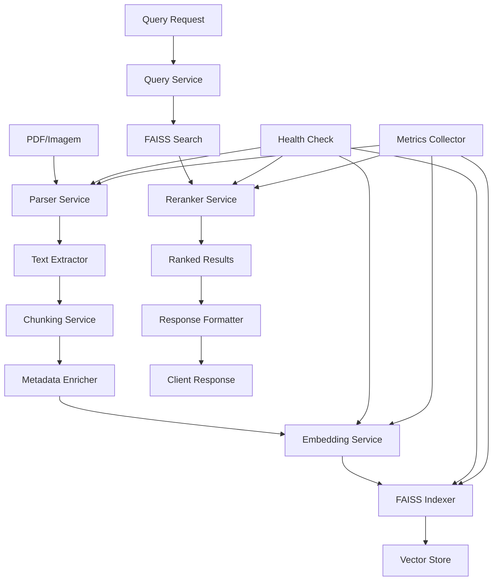

# ARCH_IA-1: Pipeline de Ingestão — Parse→Chunk→Embed→Index (+Rerank)

## 1. Diagrama (entrada→processamento→saída)



## 2. Pastas/arquivos a criar

```
/ia-1/
├── src/
│   ├── __init__.py
│   ├── main.py
│   ├── config/
│   │   ├── __init__.py
│   │   ├── settings.py
│   │   └── models.py
│   ├── services/
│   │   ├── __init__.py
│   │   ├── parser_service.py
│   │   ├── chunking_service.py
│   │   ├── embedding_service.py
│   │   ├── indexing_service.py
│   │   ├── reranker_service.py
│   │   └── query_service.py
│   ├── api/
│   │   ├── __init__.py
│   │   ├── routes.py
│   │   └── middleware.py
│   ├── utils/
│   │   ├── __init__.py
│   │   ├── logger.py
│   │   ├── metrics.py
│   │   └── file_utils.py
│   ├── models/
│   │   ├── __init__.py
│   │   ├── request.py
│   │   ├── response.py
│   │   └── document.py
│   └── storage/
│       ├── __init__.py
│       ├── faiss_store.py
│       └── metadata_store.py
├── tests/
│   ├── __init__.py
│   ├── test_parser_service.py
│   ├── test_chunking_service.py
│   ├── test_embedding_service.py
│   ├── test_indexing_service.py
│   ├── test_reranker_service.py
│   └── test_query_service.py
├── docker/
│   ├── Dockerfile
│   └── docker-compose.yml
├── docs/
│   ├── API.md
│   └── DEPLOYMENT.md
├── requirements.txt
├── Makefile
├── .env.example
└── README.md
```

## 3. Contratos (schemas/DTOs) com exemplos

### Document Upload Request
```json
{
  "file_path": "/path/to/document.pdf",
  "metadata": {
    "banca": "CESPE",
    "ano": 2024,
    "topico": "Direito Constitucional",
    "tipo": "edital",
    "orgao": "STF"
  },
  "chunk_size": 512,
  "chunk_overlap": 50
}
```

### Document Upload Response
```json
{
  "document_id": "doc_123456",
  "status": "processed",
  "chunks_created": 45,
  "processing_time": 12.5,
  "metadata": {
    "banca": "CESPE",
    "ano": 2024,
    "topico": "Direito Constitucional",
    "tipo": "edital",
    "orgao": "STF"
  },
  "timestamp": "2024-01-15T10:30:00Z"
}
```

### Query Request
```json
{
  "query": "princípios fundamentais da constituição",
  "filters": {
    "banca": "CESPE",
    "topico": "Direito Constitucional",
    "ano": 2024
  },
  "top_k": 10,
  "rerank": true,
  "similarity_threshold": 0.7
}
```

### Query Response
```json
{
  "query_id": "qry_789012",
  "results": [
    {
      "chunk_id": "chunk_001",
      "document_id": "doc_123456",
      "text": "Os princípios fundamentais da Constituição Federal...",
      "score": 0.95,
      "rerank_score": 0.98,
      "metadata": {
        "banca": "CESPE",
        "ano": 2024,
        "topico": "Direito Constitucional",
        "tipo": "edital",
        "orgao": "STF",
        "page": 15,
        "section": "Título I"
      }
    }
  ],
  "total_results": 10,
  "processing_time": 0.8,
  "timestamp": "2024-01-15T10:30:00Z"
}
```

### Chunk Schema
```json
{
  "chunk_id": "chunk_001",
  "document_id": "doc_123456",
  "text": "Texto do chunk...",
  "embedding": [0.1, 0.2, 0.3, ...],
  "metadata": {
    "banca": "CESPE",
    "ano": 2024,
    "topico": "Direito Constitucional",
    "tipo": "edital",
    "orgao": "STF",
    "page": 15,
    "section": "Título I",
    "chunk_index": 0,
    "char_start": 0,
    "char_end": 512
  },
  "created_at": "2024-01-15T10:30:00Z"
}
```

### Error Response
```json
{
  "error": "Document parsing failed",
  "code": "PARSING_ERROR",
  "details": {
    "file_path": "/path/to/document.pdf",
    "error_type": "corrupted_pdf",
    "suggestion": "Try with a different PDF file"
  },
  "timestamp": "2024-01-15T10:30:00Z"
}
```

## 4. Decisões/Trade-offs

### **Parser Service**
- **PyMuPDF vs Tesseract**: PyMuPDF para PDFs nativos, Tesseract para imagens/PDFs escaneados
- **Trade-off**: PyMuPDF é mais rápido, Tesseract é mais robusto para OCR
- **Decisão**: Usar PyMuPDF como padrão, Tesseract como fallback

### **Chunking Strategy**
- **Fixed-size vs Semantic**: Fixed-size (512 tokens) para simplicidade e performance
- **Trade-off**: Semantic chunking seria mais preciso, mas mais complexo
- **Decisão**: Fixed-size com overlap de 50 tokens para manter contexto

### **Embedding Model**
- **BGE-M3 vs OpenAI**: BGE-M3 local para custo zero e privacidade
- **Trade-off**: OpenAI seria mais preciso, mas custa e requer internet
- **Decisão**: BGE-M3 com fallback para modelos menores se necessário

### **Vector Store**
- **FAISS vs Pinecone**: FAISS local para simplicidade e custo zero
- **Trade-off**: Pinecone seria mais escalável, mas custa e requer internet
- **Decisão**: FAISS com índices separados por banca/tópico

### **Reranker**
- **BGE-Reranker-Large vs Cross-Encoder**: BGE-Reranker-Large para consistência
- **Trade-off**: Cross-Encoder seria mais preciso, mas BGE é mais consistente
- **Decisão**: BGE-Reranker-Large com threshold configurável

### **Storage Strategy**
- **In-memory vs Persistent**: Persistent para dados entre restarts
- **Trade-off**: In-memory seria mais rápido, mas perde dados
- **Decisão**: Persistent com cache em memória para performance

## 5. Checklist por etapas (P/M/G) e Riscos & Mitigações

### **Parser Service (P)**
- [ ] Implementar PyMuPDF parser
- [ ] Implementar Tesseract OCR fallback
- [ ] Adicionar validação de arquivos
- [ ] Implementar extração de metadados
- [ ] Adicionar logs estruturados

**Riscos:**
- **PDF corrompido**: Implementar validação e fallback para OCR
- **Arquivo muito grande**: Implementar streaming e chunking
- **Formato não suportado**: Implementar validação de tipos

**Mitigações:**
- Validação prévia de arquivos
- Timeout para processamento
- Fallback para OCR quando necessário

### **Chunking Service (M)**
- [ ] Implementar chunking por tamanho fixo
- [ ] Adicionar overlap configurável
- [ ] Implementar preservação de contexto
- [ ] Adicionar metadados de posição
- [ ] Implementar validação de chunks

**Riscos:**
- **Contexto perdido**: Implementar overlap e metadados
- **Chunks muito pequenos/grandes**: Validação de tamanho
- **Performance lenta**: Implementar processamento em lote

**Mitigações:**
- Overlap configurável
- Validação de tamanho mínimo/máximo
- Processamento assíncrono

### **Embedding Service (G)**
- [ ] Implementar BGE-M3 local
- [ ] Adicionar cache de embeddings
- [ ] Implementar batch processing
- [ ] Adicionar fallback para modelos menores
- [ ] Implementar métricas de qualidade

**Riscos:**
- **Modelo muito pesado**: Implementar fallback
- **Performance lenta**: Implementar cache e batch
- **Memória insuficiente**: Implementar streaming

**Mitigações:**
- Modelos menores como fallback
- Cache de embeddings
- Processamento em lote
- Monitoramento de memória

### **Indexing Service (G)**
- [ ] Implementar FAISS index
- [ ] Adicionar índices separados por banca
- [ ] Implementar persistência
- [ ] Adicionar backup/restore
- [ ] Implementar métricas de performance

**Riscos:**
- **Índice corrompido**: Implementar backup
- **Performance degradada**: Implementar otimizações
- **Memória insuficiente**: Implementar índices separados

**Mitigações:**
- Backup automático
- Índices separados por banca
- Monitoramento de performance
- Otimizações de FAISS

### **Reranker Service (M)**
- [ ] Implementar BGE-Reranker-Large
- [ ] Adicionar threshold configurável
- [ ] Implementar cache de resultados
- [ ] Adicionar métricas de qualidade
- [ ] Implementar fallback sem rerank

**Riscos:**
- **Modelo muito pesado**: Implementar fallback
- **Performance lenta**: Implementar cache
- **Qualidade ruim**: Implementar threshold

**Mitigações:**
- Fallback sem rerank
- Cache de resultados
- Threshold configurável
- Métricas de qualidade

### **Query Service (P)**
- [ ] Implementar busca por similaridade
- [ ] Adicionar filtros por metadados
- [ ] Implementar reranking
- [ ] Adicionar paginação
- [ ] Implementar cache de queries

**Riscos:**
- **Resultados irrelevantes**: Implementar threshold
- **Performance lenta**: Implementar cache
- **Filtros complexos**: Implementar índices

**Mitigações:**
- Threshold de similaridade
- Cache de queries frequentes
- Índices otimizados
- Paginação para grandes resultados

### **API Layer (P)**
- [ ] Implementar endpoints REST
- [ ] Adicionar validação de input
- [ ] Implementar rate limiting
- [ ] Adicionar autenticação
- [ ] Implementar documentação

**Riscos:**
- **Sobrecarga**: Implementar rate limiting
- **Segurança**: Implementar autenticação
- **Usabilidade**: Implementar documentação

**Mitigações:**
- Rate limiting por IP
- Autenticação JWT
- Documentação OpenAPI
- Validação rigorosa

### **Storage Layer (M)**
- [ ] Implementar persistência FAISS
- [ ] Adicionar backup automático
- [ ] Implementar restore
- [ ] Adicionar compactação
- [ ] Implementar monitoramento

**Riscos:**
- **Perda de dados**: Implementar backup
- **Corrupção**: Implementar validação
- **Performance**: Implementar otimizações

**Mitigações:**
- Backup diário automático
- Validação de integridade
- Otimizações de FAISS
- Monitoramento contínuo

### **Monitoring & Logging (P)**
- [ ] Implementar logs estruturados
- [ ] Adicionar métricas Prometheus
- [ ] Implementar health checks
- [ ] Adicionar alertas
- [ ] Implementar dashboard

**Riscos:**
- **Falhas silenciosas**: Implementar alertas
- **Debugging difícil**: Implementar logs
- **Performance não monitorada**: Implementar métricas

**Mitigações:**
- Alertas proativos
- Logs estruturados
- Métricas em tempo real
- Dashboard de monitoramento

---

**Este documento define a arquitetura completa do pipeline de ingestão IA-1, incluindo decisões técnicas, trade-offs e plano de implementação com mitigação de riscos.**
