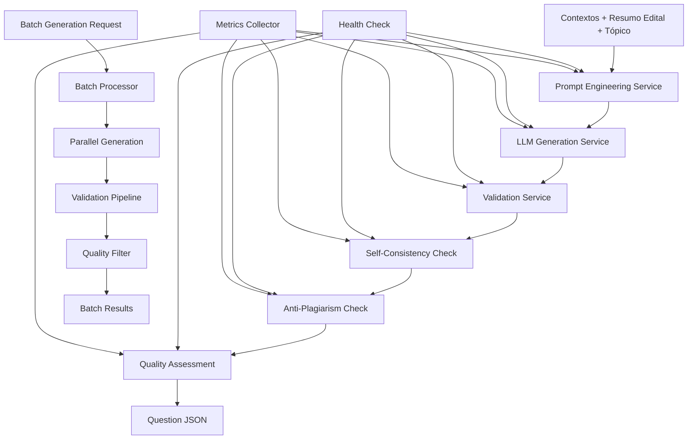

# ARCH_IA-2: Geração Condicionada por Banca+Edital com Validação Automática

## 1. Diagrama (entrada→processamento→saída)



## 2. Pastas/arquivos a criar

```
/ia-2/
├── src/
│   ├── __init__.py
│   ├── main.py
│   ├── config/
│   │   ├── __init__.py
│   │   ├── settings.py
│   │   └── models.py
│   ├── services/
│   │   ├── __init__.py
│   │   ├── prompt_engineering_service.py
│   │   ├── llm_generation_service.py
│   │   ├── validation_service.py
│   │   ├── self_consistency_service.py
│   │   ├── anti_plagiarism_service.py
│   │   ├── quality_assessment_service.py
│   │   └── batch_processor_service.py
│   ├── api/
│   │   ├── __init__.py
│   │   ├── routes.py
│   │   └── middleware.py
│   ├── utils/
│   │   ├── __init__.py
│   │   ├── logger.py
│   │   ├── metrics.py
│   │   └── text_utils.py
│   ├── models/
│   │   ├── __init__.py
│   │   ├── request.py
│   │   ├── response.py
│   │   └── question.py
│   └── validators/
│       ├── __init__.py
│       ├── question_validator.py
│       ├── consistency_validator.py
│       └── plagiarism_validator.py
├── tests/
│   ├── __init__.py
│   ├── test_prompt_engineering_service.py
│   ├── test_llm_generation_service.py
│   ├── test_validation_service.py
│   ├── test_self_consistency_service.py
│   ├── test_anti_plagiarism_service.py
│   ├── test_quality_assessment_service.py
│   └── test_batch_processor_service.py
├── prompts/
│   ├── system_prompts/
│   │   ├── cespe_prompt.txt
│   │   ├── fgv_prompt.txt
│   │   ├── vunesp_prompt.txt
│   │   └── generic_prompt.txt
│   ├── task_prompts/
│   │   ├── question_generation.txt
│   │   ├── validation.txt
│   │   └── consistency_check.txt
│   └── templates/
│       ├── question_template.json
│       └── validation_template.json
├── docker/
│   ├── Dockerfile
│   └── docker-compose.yml
├── docs/
│   ├── API.md
│   └── DEPLOYMENT.md
├── requirements.txt
├── Makefile
├── .env.example
└── README.md
```

## 3. Contratos (schemas/DTOs) com exemplos

### Question Generation Request
```json
{
  "contexts": [
    {
      "chunk_id": "chunk_001",
      "text": "Os princípios fundamentais da Constituição Federal...",
      "metadata": {
        "banca": "CESPE",
        "ano": 2024,
        "topico": "Direito Constitucional",
        "page": 15
      }
    }
  ],
  "edital_summary": {
    "banca": "CESPE",
    "ano": 2024,
    "cargo": "Analista Judiciário",
    "orgao": "STF",
    "topico": "Direito Constitucional",
    "dificuldade": "intermediaria",
    "estilo": "conceitual"
  },
  "topic": "Direito Constitucional",
  "generation_config": {
    "num_questions": 1,
    "difficulty": "intermediaria",
    "style": "conceitual",
    "validation_level": "strict"
  }
}
```

### Question Generation Response
```json
{
  "question_id": "q_123456",
  "question": "Qual é o princípio fundamental da Constituição Federal que estabelece a separação dos poderes?",
  "alternatives": {
    "A": "Princípio da legalidade",
    "B": "Princípio da separação dos poderes",
    "C": "Princípio da igualdade",
    "D": "Princípio da dignidade da pessoa humana",
    "E": "Princípio da publicidade"
  },
  "correct_answer": "B",
  "justification": "O princípio da separação dos poderes está expressamente previsto no art. 2º da CF/88, estabelecendo a independência e harmonia entre os Poderes Executivo, Legislativo e Judiciário.",
  "source_chunks": ["chunk_001", "chunk_002"],
  "metadata": {
    "banca": "CESPE",
    "ano": 2024,
    "topico": "Direito Constitucional",
    "dificuldade": "intermediaria",
    "estilo": "conceitual",
    "plausibilidade_score": 0.95,
    "consistency_score": 0.92,
    "plagiarism_score": 0.05
  },
  "generation_time": 2.5,
  "timestamp": "2024-01-15T10:30:00Z"
}
```

### Batch Generation Request
```json
{
  "batch_id": "batch_789012",
  "requests": [
    {
      "contexts": [...],
      "edital_summary": {...},
      "topic": "Direito Constitucional"
    },
    {
      "contexts": [...],
      "edital_summary": {...},
      "topic": "Direito Administrativo"
    }
  ],
  "batch_config": {
    "max_parallel": 5,
    "timeout_per_question": 30,
    "quality_threshold": 0.9,
    "validation_level": "strict"
  }
}
```

### Batch Generation Response
```json
{
  "batch_id": "batch_789012",
  "status": "completed",
  "total_requests": 10,
  "successful": 8,
  "failed": 2,
  "questions": [
    {
      "question_id": "q_123456",
      "question": "...",
      "alternatives": {...},
      "correct_answer": "B",
      "justification": "...",
      "source_chunks": [...],
      "metadata": {...}
    }
  ],
  "failed_requests": [
    {
      "index": 2,
      "error": "Validation failed: low plausibility score",
      "details": {...}
    }
  ],
  "processing_time": 45.2,
  "timestamp": "2024-01-15T10:30:00Z"
}
```

### Validation Request
```json
{
  "question": "Qual é o princípio fundamental da Constituição Federal?",
  "alternatives": {
    "A": "Princípio da legalidade",
    "B": "Princípio da separação dos poderes",
    "C": "Princípio da igualdade"
  },
  "correct_answer": "B",
  "justification": "O princípio da separação dos poderes...",
  "source_chunks": ["chunk_001"],
  "validation_config": {
    "check_consistency": true,
    "check_plagiarism": true,
    "check_quality": true,
    "consistency_threshold": 0.8,
    "plagiarism_threshold": 0.3,
    "quality_threshold": 0.9
  }
}
```

### Validation Response
```json
{
  "validation_id": "val_345678",
  "is_valid": true,
  "scores": {
    "plausibility": 0.95,
    "consistency": 0.92,
    "plagiarism": 0.05,
    "quality": 0.94
  },
  "checks": {
    "uniqueness": {
      "passed": true,
      "score": 1.0,
      "details": "Gabarito único identificado"
    },
    "consistency": {
      "passed": true,
      "score": 0.92,
      "details": "Justificativa coerente com resposta"
    },
    "plagiarism": {
      "passed": true,
      "score": 0.05,
      "details": "Baixo risco de plágio"
    },
    "quality": {
      "passed": true,
      "score": 0.94,
      "details": "Questão bem formulada"
    }
  },
  "recommendations": [
    "Considerar adicionar mais contexto na justificativa"
  ],
  "validation_time": 1.2,
  "timestamp": "2024-01-15T10:30:00Z"
}
```

### Health Check Response
```json
{
  "status": "healthy",
  "services": {
    "prompt_engineering": {
      "status": "healthy",
      "response_time": 0.1,
      "prompts_loaded": 4
    },
    "llm_generation": {
      "status": "healthy",
      "response_time": 2.5,
      "model_loaded": "llama-3.1-8b"
    },
    "validation": {
      "status": "healthy",
      "response_time": 1.2,
      "validators_active": 3
    },
    "self_consistency": {
      "status": "healthy",
      "response_time": 0.8,
      "checks_performed": 150
    },
    "anti_plagiarism": {
      "status": "healthy",
      "response_time": 0.5,
      "checks_performed": 150
    },
    "quality_assessment": {
      "status": "healthy",
      "response_time": 0.3,
      "assessments_performed": 150
    }
  },
  "uptime": 3600.5,
  "timestamp": "2024-01-15T10:30:00Z"
}
```

## 4. Decisões/Trade-offs

### **Prompt Engineering**
- **Templates específicos por banca vs Template genérico**: Templates específicos para melhor qualidade
- **Trade-off**: Mais complexidade vs melhor adaptação ao estilo
- **Decisão**: Templates específicos para CESPE, FGV, VUNESP + template genérico

### **LLM Selection**
- **Ollama local vs API externa**: Ollama local para custo zero e privacidade
- **Trade-off**: API externa seria mais precisa, mas custa e requer internet
- **Decisão**: Ollama com modelo Llama-3.1-8B + fallback para modelos menores

### **Validation Strategy**
- **Validação rigorosa vs Validação rápida**: Validação rigorosa para qualidade
- **Trade-off**: Mais tempo vs melhor qualidade
- **Decisão**: Validação configurável (strict/medium/loose)

### **Self-Consistency**
- **2x consistency check vs 1x check**: 2x para maior confiabilidade
- **Trade-off**: Mais tempo vs maior consistência
- **Decisão**: 2x consistency check com timeout configurável

### **Anti-Plagiarism**
- **Detecção rigorosa vs Detecção básica**: Detecção básica para MVP
- **Trade-off**: Complexidade vs proteção
- **Decisão**: Detecção básica com threshold configurável

### **Batch Processing**
- **Processamento paralelo vs Sequencial**: Paralelo para performance
- **Trade-off**: Complexidade vs velocidade
- **Decisão**: Processamento paralelo com limite configurável

### **Quality Assessment**
- **Métricas múltiplas vs Métrica única**: Múltiplas métricas para avaliação completa
- **Trade-off**: Complexidade vs precisão
- **Decisão**: Múltiplas métricas com peso configurável

## 5. Checklist por etapas (P/M/G) e Riscos & Mitigações

### **Prompt Engineering Service (P)**
- [ ] Implementar templates específicos por banca
- [ ] Implementar template genérico
- [ ] Adicionar validação de templates
- [ ] Implementar cache de prompts
- [ ] Adicionar logs estruturados

**Riscos:**
- **Templates malformados**: Validação rigorosa de templates
- **Cache inválido**: Invalidação automática de cache
- **Prompts muito longos**: Limite de tamanho configurável

**Mitigações:**
- Validação de templates em tempo de execução
- Cache com TTL configurável
- Limite de tamanho de prompt

### **LLM Generation Service (G)**
- [ ] Implementar integração com Ollama
- [ ] Adicionar fallback para modelos menores
- [ ] Implementar timeout configurável
- [ ] Adicionar retry logic
- [ ] Implementar métricas de performance

**Riscos:**
- **Modelo não carregado**: Verificação de saúde do modelo
- **Timeout de geração**: Timeout configurável
- **Memória insuficiente**: Fallback para modelos menores
- **Qualidade inconsistente**: Validação pós-geração

**Mitigações:**
- Health check do modelo
- Timeout configurável
- Fallback automático
- Validação obrigatória

### **Validation Service (M)**
- [ ] Implementar validação de unicidade
- [ ] Implementar validação de formato
- [ ] Adicionar validação de conteúdo
- [ ] Implementar validação configurável
- [ ] Adicionar logs de validação

**Riscos:**
- **Validação muito rigorosa**: Configuração flexível
- **Performance lenta**: Validação assíncrona
- **Falsos positivos**: Thresholds configuráveis

**Mitigações:**
- Níveis de validação configuráveis
- Validação assíncrona
- Thresholds ajustáveis

### **Self-Consistency Service (M)**
- [ ] Implementar verificação 2x
- [ ] Adicionar timeout configurável
- [ ] Implementar cache de verificações
- [ ] Adicionar métricas de consistência
- [ ] Implementar fallback para 1x

**Riscos:**
- **Verificação muito lenta**: Timeout configurável
- **Inconsistência detectada**: Fallback para 1x
- **Cache inválido**: Invalidação automática

**Mitigações:**
- Timeout configurável
- Fallback automático
- Cache com TTL

### **Anti-Plagiarism Service (P)**
- [ ] Implementar detecção básica
- [ ] Adicionar threshold configurável
- [ ] Implementar cache de verificações
- [ ] Adicionar métricas de plágio
- [ ] Implementar whitelist de fontes

**Riscos:**
- **Falsos positivos**: Threshold configurável
- **Performance lenta**: Cache de verificações
- **Detecção inadequada**: Whitelist de fontes

**Mitigações:**
- Threshold configurável
- Cache de verificações
- Whitelist de fontes confiáveis

### **Quality Assessment Service (M)**
- [ ] Implementar métricas múltiplas
- [ ] Adicionar pesos configuráveis
- [ ] Implementar threshold configurável
- [ ] Adicionar cache de avaliações
- [ ] Implementar métricas de qualidade

**Riscos:**
- **Avaliação inconsistente**: Métricas padronizadas
- **Performance lenta**: Cache de avaliações
- **Threshold inadequado**: Configuração flexível

**Mitigações:**
- Métricas padronizadas
- Cache de avaliações
- Thresholds configuráveis

### **Batch Processor Service (G)**
- [ ] Implementar processamento paralelo
- [ ] Adicionar limite de paralelismo
- [ ] Implementar timeout por questão
- [ ] Adicionar retry logic
- [ ] Implementar métricas de batch

**Riscos:**
- **Sobrecarga do sistema**: Limite de paralelismo
- **Timeout de batch**: Timeout por questão
- **Falha em cascata**: Retry logic
- **Memória insuficiente**: Processamento em lotes

**Mitigações:**
- Limite de paralelismo configurável
- Timeout por questão
- Retry com backoff
- Processamento em lotes

### **API Layer (P)**
- [ ] Implementar endpoints REST
- [ ] Adicionar validação de input
- [ ] Implementar rate limiting
- [ ] Adicionar autenticação
- [ ] Implementar documentação

**Riscos:**
- **Sobrecarga da API**: Rate limiting
- **Segurança**: Autenticação obrigatória
- **Usabilidade**: Documentação completa

**Mitigações:**
- Rate limiting por IP
- Autenticação JWT
- Documentação OpenAPI

### **Monitoring & Logging (P)**
- [ ] Implementar logs estruturados
- [ ] Adicionar métricas Prometheus
- [ ] Implementar health checks
- [ ] Adicionar alertas
- [ ] Implementar dashboard

**Riscos:**
- **Falhas silenciosas**: Alertas proativos
- **Debugging difícil**: Logs estruturados
- **Performance não monitorada**: Métricas em tempo real

**Mitigações:**
- Alertas proativos
- Logs estruturados
- Métricas em tempo real
- Dashboard de monitoramento

---

**Este documento define a arquitetura completa do sistema de geração condicionada IA-2, incluindo decisões técnicas, trade-offs e plano de implementação com mitigação de riscos.**
