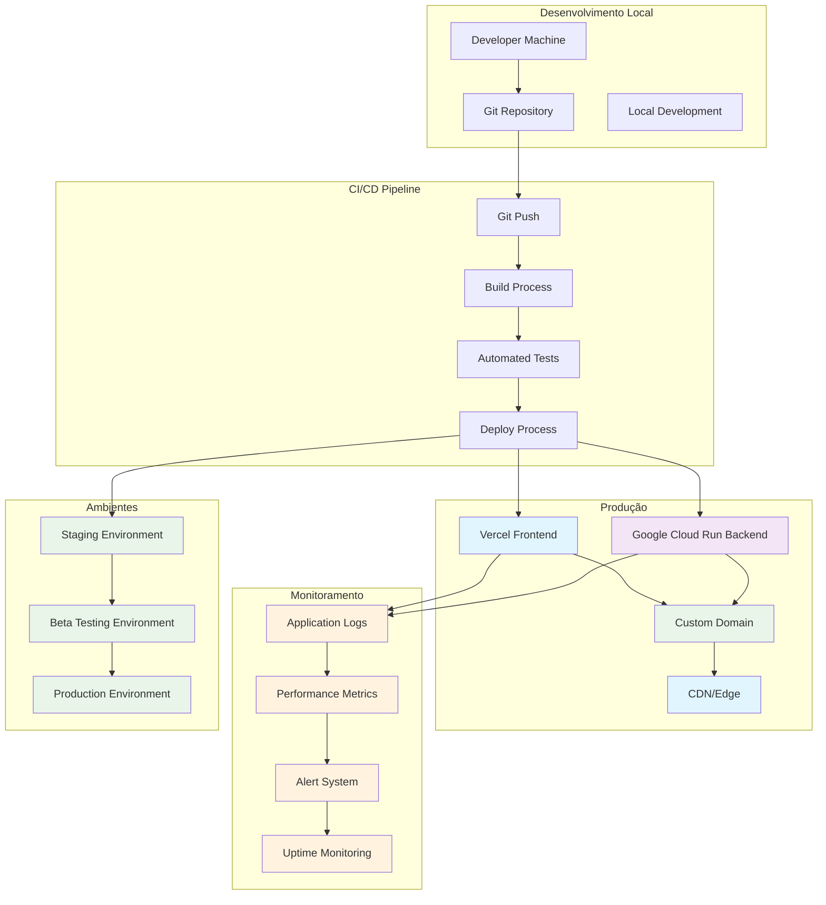

# ARCH_OPS-001: Deploy Mínimo (Vercel/Cloud Run)

## 1. Diagrama de Arquitetura



## 2. Estrutura de Pastas

```
concurso-ai-orchestrated/
├── .github/
│   └── workflows/
│       ├── deploy-frontend.yml
│       ├── deploy-backend.yml
│       └── deploy-staging.yml
├── .vercel/
│   ├── project.json
│   └── settings.json
├── .gcloud/
│   ├── service-account.json
│   └── cloudbuild.yaml
├── docs/
│   ├── deployment/
│   │   ├── README.md
│   │   ├── environment-setup.md
│   │   ├── domain-configuration.md
│   │   └── monitoring-setup.md
│   └── troubleshooting/
│       ├── common-issues.md
│       └── rollback-procedures.md
├── scripts/
│   ├── deploy/
│   │   ├── deploy-frontend.sh
│   │   ├── deploy-backend.sh
│   │   ├── deploy-staging.sh
│   │   └── health-check.sh
│   ├── build/
│   │   ├── build-frontend.sh
│   │   ├── build-backend.sh
│   │   └── build-all.sh
│   └── utils/
│       ├── env-validator.sh
│       ├── domain-checker.sh
│       └── backup.sh
├── config/
│   ├── environments/
│   │   ├── development.env
│   │   ├── staging.env
│   │   ├── production.env
│   │   └── beta.env
│   ├── docker/
│   │   ├── Dockerfile.frontend
│   │   ├── Dockerfile.backend
│   │   └── docker-compose.yml
│   └── cloud/
│       ├── cloud-run.yaml
│       ├── vercel.json
│       └── terraform/
│           ├── main.tf
│           ├── variables.tf
│           └── outputs.tf
├── monitoring/
│   ├── dashboards/
│   │   ├── frontend-dashboard.json
│   │   ├── backend-dashboard.json
│   │   └── infrastructure-dashboard.json
│   ├── alerts/
│   │   ├── uptime-alerts.yml
│   │   ├── performance-alerts.yml
│   │   └── error-alerts.yml
│   └── logs/
│       ├── log-aggregation.yml
│       └── log-retention.yml
└── tests/
    ├── deployment/
    │   ├── smoke-tests.js
    │   ├── integration-tests.js
    │   └── performance-tests.js
    └── e2e/
        ├── user-journey.spec.js
        └── api-endpoints.spec.js
```

## 3. Contratos de Deploy

### **Frontend (Vercel)**
```json
{
  "version": 2,
  "name": "concurso-ai-frontend",
  "builds": [
    {
      "src": "package.json",
      "use": "@vercel/next"
    }
  ],
  "routes": [
    {
      "src": "/(.*)",
      "dest": "/$1"
    }
  ],
  "env": {
    "NEXT_PUBLIC_API_URL": "@api-url",
    "NEXT_PUBLIC_APP_NAME": "@app-name",
    "NEXT_PUBLIC_ENVIRONMENT": "@environment"
  },
  "functions": {
    "app/api/**/*.js": {
      "maxDuration": 30
    }
  },
  "regions": ["iad1", "sfo1"],
  "domains": ["concurso-ai.com", "www.concurso-ai.com"]
}
```

### **Backend (Google Cloud Run)**
```yaml
apiVersion: serving.knative.dev/v1
kind: Service
metadata:
  name: concurso-ai-backend
  annotations:
    run.googleapis.com/ingress: all
    run.googleapis.com/execution-environment: gen2
spec:
  template:
    metadata:
      annotations:
        autoscaling.knative.dev/maxScale: "10"
        autoscaling.knative.dev/minScale: "1"
        run.googleapis.com/cpu-throttling: "false"
        run.googleapis.com/execution-environment: gen2
    spec:
      containerConcurrency: 100
      timeoutSeconds: 300
      containers:
      - image: gcr.io/concurso-ai/backend:latest
        ports:
        - containerPort: 8000
        env:
        - name: ENVIRONMENT
          value: "production"
        - name: DATABASE_URL
          valueFrom:
            secretKeyRef:
              name: database-secret
              key: url
        - name: JWT_SECRET
          valueFrom:
            secretKeyRef:
              name: jwt-secret
              key: secret
        resources:
          limits:
            cpu: "2"
            memory: "2Gi"
          requests:
            cpu: "1"
            memory: "1Gi"
        livenessProbe:
          httpGet:
            path: /health
            port: 8000
          initialDelaySeconds: 30
          periodSeconds: 10
        readinessProbe:
          httpGet:
            path: /ready
            port: 8000
          initialDelaySeconds: 5
          periodSeconds: 5
```

### **Domain Configuration**
```yaml
domains:
  production:
    frontend: "concurso-ai.com"
    backend: "api.concurso-ai.com"
    cdn: "cdn.concurso-ai.com"
  staging:
    frontend: "staging.concurso-ai.com"
    backend: "api-staging.concurso-ai.com"
  beta:
    frontend: "beta.concurso-ai.com"
    backend: "api-beta.concurso-ai.com"
```

## 4. Decisões Arquiteturais

### **4.1 Plataforma de Deploy**

#### **Frontend: Vercel**
- **Justificativa**: Otimizado para Next.js, deploy automático, CDN global
- **Benefícios**: 
  - Deploy automático via Git
  - CDN global integrado
  - Preview deployments
  - Analytics integrado
- **Limitações**: 
  - Vendor lock-in
  - Limitações de função serverless

#### **Backend: Google Cloud Run**
- **Justificativa**: Serverless, escalável, integração com GCP
- **Benefícios**:
  - Auto-scaling
  - Pay-per-use
  - Integração com outros serviços GCP
  - Suporte a containers
- **Limitações**:
  - Cold start latency
  - Limitações de memória/CPU

### **4.2 Estratégia de Deploy**

#### **Blue-Green Deployment**
- **Justificativa**: Zero downtime, rollback rápido
- **Implementação**:
  - Staging → Beta → Production
  - Health checks obrigatórios
  - Rollback automático em caso de falha

#### **Feature Flags**
- **Justificativa**: Deploy seguro, teste A/B
- **Implementação**:
  - Flags por usuário/ambiente
  - Configuração via environment variables
  - Dashboard de controle

### **4.3 Monitoramento**

#### **Logs Centralizados**
- **Justificativa**: Debugging, compliance, auditoria
- **Implementação**:
  - Google Cloud Logging
  - Vercel Analytics
  - Log aggregation

#### **Métricas de Performance**
- **Justificativa**: SLA, otimização, alertas
- **Implementação**:
  - Google Cloud Monitoring
  - Vercel Analytics
  - Custom metrics

#### **Alertas**
- **Justificativa**: Resposta rápida a problemas
- **Implementação**:
  - Slack notifications
  - Email alerts
  - PagerDuty integration

### **4.4 Segurança**

#### **Secrets Management**
- **Justificativa**: Segurança, compliance
- **Implementação**:
  - Google Secret Manager
  - Vercel Environment Variables
  - Encryption at rest

#### **HTTPS/TLS**
- **Justificativa**: Segurança, SEO
- **Implementação**:
  - Let's Encrypt via Vercel
  - Google Cloud Load Balancer
  - HSTS headers

#### **CORS Configuration**
- **Justificativa**: Segurança, controle de acesso
- **Implementação**:
  - Whitelist de domínios
  - Environment-specific configs
  - Preflight handling

## 5. Checklist de Deploy

### **5.1 Pré-Deploy**
- [ ] **Código revisado e aprovado**
  - [ ] Code review aprovado
  - [ ] Tests passando
  - [ ] Linting sem erros
  - [ ] Security scan aprovado

- [ ] **Configuração de ambiente**
  - [ ] Environment variables configuradas
  - [ ] Secrets atualizados
  - [ ] Database migrations preparadas
  - [ ] DNS records configurados

- [ ] **Build e testes**
  - [ ] Build local funcionando
  - [ ] Tests unitários passando
  - [ ] Tests de integração passando
  - [ ] Tests E2E passando

### **5.2 Deploy**

- [ ] **Deploy para staging**
  - [ ] Deploy frontend para staging
  - [ ] Deploy backend para staging
  - [ ] Health checks passando
  - [ ] Smoke tests passando

- [ ] **Deploy para beta**
  - [ ] Deploy frontend para beta
  - [ ] Deploy backend para beta
  - [ ] Health checks passando
  - [ ] Integration tests passando

- [ ] **Deploy para produção**
  - [ ] Deploy frontend para produção
  - [ ] Deploy backend para produção
  - [ ] Health checks passando
  - [ ] E2E tests passando

### **5.3 Pós-Deploy**

- [ ] **Verificação de funcionamento**
  - [ ] Frontend acessível
  - [ ] Backend APIs funcionando
  - [ ] Database conectado
  - [ ] CDN funcionando

- [ ] **Monitoramento**
  - [ ] Logs sendo coletados
  - [ ] Métricas sendo coletadas
  - [ ] Alertas configurados
  - [ ] Uptime monitor ativo

- [ ] **Documentação**
  - [ ] Changelog atualizado
  - [ ] Documentação atualizada
  - [ ] Runbook atualizado
  - [ ] Troubleshooting guide atualizado

### **5.4 Rollback (se necessário)**

- [ ] **Identificação do problema**
  - [ ] Logs analisados
  - [ ] Métricas analisadas
  - [ ] Root cause identificado
  - [ ] Impacto avaliado

- [ ] **Execução do rollback**
  - [ ] Rollback frontend
  - [ ] Rollback backend
  - [ ] Database rollback (se necessário)
  - [ ] DNS rollback (se necessário)

- [ ] **Verificação pós-rollback**
  - [ ] Sistema funcionando
  - [ ] Health checks passando
  - [ ] Usuários impactados notificados
  - [ ] Post-mortem agendado

## 6. Riscos e Mitigações

### **6.1 Riscos Técnicos**

#### **Deploy Failure**
- **Risco**: Falha no processo de deploy
- **Impacto**: Downtime, usuários impactados
- **Mitigação**: 
  - Blue-green deployment
  - Health checks obrigatórios
  - Rollback automático
  - Staging environment

#### **Performance Degradation**
- **Risco**: Performance pior após deploy
- **Impacto**: UX degradada, usuários insatisfeitos
- **Mitigação**:
  - Performance tests
  - Load testing
  - Monitoring contínuo
  - Auto-scaling

#### **Data Loss**
- **Risco**: Perda de dados durante deploy
- **Impacto**: Dados críticos perdidos
- **Mitigação**:
  - Database backups
  - Migration rollback
  - Data validation
  - Staging testing

### **6.2 Riscos de Segurança**

#### **Secrets Exposure**
- **Risco**: Exposição de secrets
- **Impacto**: Comprometimento de segurança
- **Mitigação**:
  - Secret management
  - Encryption at rest
  - Access controls
  - Audit logs

#### **DDoS Attack**
- **Risco**: Ataque de negação de serviço
- **Impacto**: Sistema indisponível
- **Mitigação**:
  - CDN protection
  - Rate limiting
  - Auto-scaling
  - Monitoring

### **6.3 Riscos de Negócio**

#### **User Impact**
- **Risco**: Impacto negativo nos usuários
- **Impacto**: Churn, reputação
- **Mitigação**:
  - Feature flags
  - Gradual rollout
  - User communication
  - Support team ready

#### **Compliance Issues**
- **Risco**: Violação de compliance
- **Impacto**: Multas, reputação
- **Mitigação**:
  - Compliance review
  - Data protection
  - Audit trails
  - Legal review

## 7. Métricas de Sucesso

### **7.1 Deploy Metrics**
- **Deploy Success Rate**: > 99%
- **Deploy Duration**: < 10 minutos
- **Rollback Rate**: < 5%
- **Zero Downtime**: 100%

### **7.2 Performance Metrics**
- **Frontend Load Time**: < 2 segundos
- **API Response Time**: < 500ms
- **Uptime**: > 99.9%
- **Error Rate**: < 0.1%

### **7.3 User Experience Metrics**
- **Page Load Success**: > 99.9%
- **API Success Rate**: > 99.9%
- **User Satisfaction**: > 4.5/5
- **Support Tickets**: < 1% dos usuários

---

**Este documento define a arquitetura de deploy mínima para o MVP, incluindo Vercel para frontend, Google Cloud Run para backend, e estratégias de monitoramento e rollback.**
