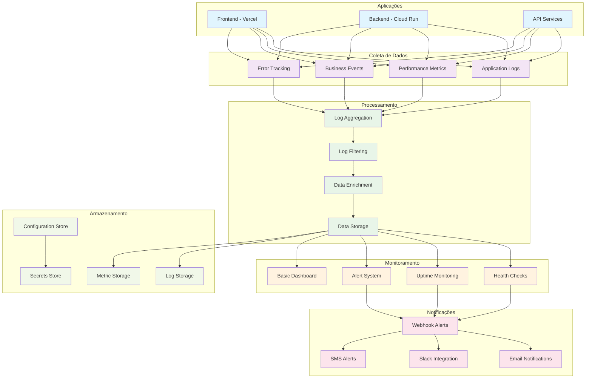

# ARCH_OPS-002: Observabilidade Básica (Logs + Uptime)

## 1. Diagrama de Arquitetura



## 2. Estrutura de Pastas

```
concurso-ai-orchestrated/
├── monitoring/
│   ├── config/
│   │   ├── logging.yaml
│   │   ├── metrics.yaml
│   │   ├── alerts.yaml
│   │   └── dashboards.yaml
│   ├── collectors/
│   │   ├── log-collector/
│   │   │   ├── Dockerfile
│   │   │   ├── collector.py
│   │   │   └── requirements.txt
│   │   ├── metric-collector/
│   │   │   ├── Dockerfile
│   │   │   ├── collector.py
│   │   │   └── requirements.txt
│   │   └── health-checker/
│   │       ├── Dockerfile
│   │       ├── checker.py
│   │       └── requirements.txt
│   ├── processors/
│   │   ├── log-processor/
│   │   │   ├── Dockerfile
│   │   │   ├── processor.py
│   │   │   └── requirements.txt
│   │   ├── metric-processor/
│   │   │   ├── Dockerfile
│   │   │   ├── processor.py
│   │   │   └── requirements.txt
│   │   └── alert-processor/
│   │       ├── Dockerfile
│   │       ├── processor.py
│   │       └── requirements.txt
│   ├── storage/
│   │   ├── log-storage/
│   │   │   ├── Dockerfile
│   │   │   ├── storage.py
│   │   │   └── requirements.txt
│   │   ├── metric-storage/
│   │   │   ├── Dockerfile
│   │   │   ├── storage.py
│   │   │   └── requirements.txt
│   │   └── config-storage/
│   │       ├── Dockerfile
│   │       ├── storage.py
│   │       └── requirements.txt
│   ├── notifiers/
│   │   ├── webhook-notifier/
│   │   │   ├── Dockerfile
│   │   │   ├── notifier.py
│   │   │   └── requirements.txt
│   │   ├── email-notifier/
│   │   │   ├── Dockerfile
│   │   │   ├── notifier.py
│   │   │   └── requirements.txt
│   │   ├── slack-notifier/
│   │   │   ├── Dockerfile
│   │   │   ├── notifier.py
│   │   │   └── requirements.txt
│   │   └── sms-notifier/
│   │       ├── Dockerfile
│   │       ├── notifier.py
│   │       └── requirements.txt
│   ├── dashboards/
│   │   ├── basic-dashboard/
│   │   │   ├── index.html
│   │   │   ├── dashboard.js
│   │   │   └── dashboard.css
│   │   ├── health-dashboard/
│   │   │   ├── index.html
│   │   │   ├── dashboard.js
│   │   │   └── dashboard.css
│   │   └── uptime-dashboard/
│   │       ├── index.html
│   │       ├── dashboard.js
│   │       └── dashboard.css
│   ├── scripts/
│   │   ├── setup-monitoring.sh
│   │   ├── deploy-monitoring.sh
│   │   ├── health-check.sh
│   │   └── alert-test.sh
│   └── docs/
│       ├── logging-policy.md
│       ├── metrics-policy.md
│       ├── alerting-policy.md
│       └── troubleshooting.md
├── src/
│   ├── monitoring/
│   │   ├── __init__.py
│   │   ├── logger.py
│   │   ├── metrics.py
│   │   ├── health.py
│   │   ├── alerts.py
│   │   └── config.py
│   ├── utils/
│   │   ├── __init__.py
│   │   ├── decorators.py
│   │   ├── middleware.py
│   │   └── helpers.py
│   └── api/
│       ├── __init__.py
│       ├── health.py
│       ├── metrics.py
│       └── logs.py
├── tests/
│   ├── monitoring/
│   │   ├── test_logger.py
│   │   ├── test_metrics.py
│   │   ├── test_health.py
│   │   └── test_alerts.py
│   └── integration/
│       ├── test_monitoring_integration.py
│       └── test_alert_integration.py
├── docker-compose.monitoring.yml
├── monitoring.env
└── README.md
```

## 3. Contratos de Monitoramento

### **Logging Policy**
```yaml
logging:
  levels:
    - DEBUG
    - INFO
    - WARNING
    - ERROR
    - CRITICAL
  
  fields:
    required:
      - timestamp
      - level
      - message
      - service
      - version
      - environment
      - request_id
      - user_id
      - session_id
    
    optional:
      - correlation_id
      - trace_id
      - span_id
      - duration
      - status_code
      - method
      - path
      - user_agent
      - ip_address
      - error_code
      - error_message
      - stack_trace
      - metadata
  
  format:
    type: json
    timestamp_format: ISO8601
    timezone: UTC
  
  retention:
    debug: 7 days
    info: 30 days
    warning: 90 days
    error: 365 days
    critical: 365 days
  
  sampling:
    debug: 10%
    info: 100%
    warning: 100%
    error: 100%
    critical: 100%
```

### **Metrics Policy**
```yaml
metrics:
  types:
    - counter
    - gauge
    - histogram
    - summary
  
  labels:
    required:
      - service
      - version
      - environment
      - instance
    
    optional:
      - method
      - endpoint
      - status_code
      - user_type
      - region
      - datacenter
  
  collection:
    interval: 15s
    timeout: 5s
    retries: 3
  
  storage:
    retention: 30 days
    compression: gzip
    format: prometheus
  
  aggregation:
    - sum
    - avg
    - min
    - max
    - count
    - percentile_95
    - percentile_99
```

### **Health Check Policy**
```yaml
health_checks:
  endpoints:
    - /health
    - /ready
    - /live
  
  checks:
    database:
      type: connection
      timeout: 5s
      interval: 30s
      retries: 3
    
    cache:
      type: connection
      timeout: 3s
      interval: 30s
      retries: 3
    
    external_apis:
      type: http
      timeout: 10s
      interval: 60s
      retries: 2
    
    disk_space:
      type: system
      threshold: 80%
      interval: 300s
    
    memory:
      type: system
      threshold: 90%
      interval: 300s
  
  response:
    format: json
    fields:
      - status
      - timestamp
      - version
      - checks
      - uptime
      - response_time
```

### **Alerting Policy**
```yaml
alerting:
  channels:
    webhook:
      url: ${WEBHOOK_URL}
      timeout: 10s
      retries: 3
    
    email:
      smtp_host: ${SMTP_HOST}
      smtp_port: ${SMTP_PORT}
      from: ${EMAIL_FROM}
      to: ${EMAIL_TO}
    
    slack:
      webhook_url: ${SLACK_WEBHOOK_URL}
      channel: ${SLACK_CHANNEL}
      username: ${SLACK_USERNAME}
    
    sms:
      provider: ${SMS_PROVIDER}
      api_key: ${SMS_API_KEY}
      from: ${SMS_FROM}
      to: ${SMS_TO}
  
  rules:
    high_error_rate:
      condition: error_rate > 5%
      duration: 5m
      severity: critical
      channels: [webhook, email, slack]
    
    high_response_time:
      condition: response_time_p95 > 2s
      duration: 10m
      severity: warning
      channels: [webhook, slack]
    
    service_down:
      condition: health_check_failed
      duration: 1m
      severity: critical
      channels: [webhook, email, slack, sms]
    
    disk_space_low:
      condition: disk_usage > 85%
      duration: 5m
      severity: warning
      channels: [webhook, slack]
    
    memory_high:
      condition: memory_usage > 90%
      duration: 5m
      severity: warning
      channels: [webhook, slack]
  
  escalation:
    levels:
      - immediate
      - 5_minutes
      - 15_minutes
      - 1_hour
    
    actions:
      - notify
      - page
      - auto_remediate
      - escalate
```

## 4. Decisões Arquiteturais

### **4.1 Estratégia de Logging**

#### **Structured Logging**
- **Justificativa**: Facilita parsing, filtering e análise
- **Implementação**: JSON format com campos padronizados
- **Benefícios**: 
  - Facilita análise automatizada
  - Melhora performance de parsing
  - Permite filtering eficiente
- **Limitações**: 
  - Maior overhead de serialização
  - Requer ferramentas de parsing

#### **Log Levels**
- **Justificativa**: Controle granular de verbosidade
- **Implementação**: DEBUG, INFO, WARNING, ERROR, CRITICAL
- **Benefícios**:
  - Controle de volume de logs
  - Foco em problemas importantes
  - Debugging eficiente
- **Limitações**:
  - Pode mascarar problemas
  - Requer configuração cuidadosa

### **4.2 Estratégia de Métricas**

#### **Prometheus-style Metrics**
- **Justificativa**: Padrão da indústria, amplamente suportado
- **Implementação**: Counter, Gauge, Histogram, Summary
- **Benefícios**:
  - Padrão da indústria
  - Ferramentas maduras
  - Query language poderosa
- **Limitações**:
  - Curva de aprendizado
  - Overhead de coleta

#### **Metric Collection**
- **Justificativa**: Coleta eficiente e confiável
- **Implementação**: Pull-based com intervalos configuráveis
- **Benefícios**:
  - Controle de frequência
  - Redução de overhead
  - Confiabilidade
- **Limitações**:
  - Latência de coleta
  - Complexidade de configuração

### **4.3 Estratégia de Health Checks**

#### **Multi-level Health Checks**
- **Justificativa**: Verificação abrangente de saúde
- **Implementação**: /health, /ready, /live endpoints
- **Benefícios**:
  - Verificação granular
  - Suporte a load balancers
  - Debugging eficiente
- **Limitações**:
  - Complexidade de implementação
  - Overhead de verificação

#### **Dependency Checking**
- **Justificativa**: Verificação de dependências críticas
- **Implementação**: Database, cache, external APIs
- **Benefícios**:
  - Detecção precoce de problemas
  - Isolamento de falhas
  - Debugging eficiente
- **Limitações**:
  - Overhead de verificação
  - Complexidade de configuração

### **4.4 Estratégia de Alerting**

#### **Multi-channel Alerting**
- **Justificativa**: Redundância e flexibilidade
- **Implementação**: Webhook, email, Slack, SMS
- **Benefícios**:
  - Redundância de notificação
  - Flexibilidade de canais
  - Escalabilidade
- **Limitações**:
  - Complexidade de configuração
  - Overhead de notificação

#### **Alert Escalation**
- **Justificativa**: Resposta adequada a diferentes severidades
- **Implementação**: Níveis de escalação com timeouts
- **Benefícios**:
  - Resposta adequada
  - Redução de alert fatigue
  - Escalação automática
- **Limitações**:
  - Complexidade de configuração
  - Possível escalação desnecessária

## 5. Checklist de Implementação

### **5.1 Configuração de Logging**
- [ ] **Configurar structured logging**
  - [ ] Definir formato JSON
  - [ ] Configurar campos obrigatórios
  - [ ] Configurar campos opcionais
  - [ ] Configurar timezone UTC

- [ ] **Configurar níveis de log**
  - [ ] Configurar DEBUG (10% sampling)
  - [ ] Configurar INFO (100% sampling)
  - [ ] Configurar WARNING (100% sampling)
  - [ ] Configurar ERROR (100% sampling)
  - [ ] Configurar CRITICAL (100% sampling)

- [ ] **Configurar retenção**
  - [ ] DEBUG: 7 dias
  - [ ] INFO: 30 dias
  - [ ] WARNING: 90 dias
  - [ ] ERROR: 365 dias
  - [ ] CRITICAL: 365 dias

### **5.2 Configuração de Métricas**
- [ ] **Configurar tipos de métricas**
  - [ ] Counter para contadores
  - [ ] Gauge para valores instantâneos
  - [ ] Histogram para distribuições
  - [ ] Summary para percentis

- [ ] **Configurar labels**
  - [ ] Labels obrigatórios (service, version, environment)
  - [ ] Labels opcionais (method, endpoint, status_code)
  - [ ] Configurar cardinalidade

- [ ] **Configurar coleta**
  - [ ] Intervalo de 15 segundos
  - [ ] Timeout de 5 segundos
  - [ ] 3 tentativas
  - [ ] Retenção de 30 dias

### **5.3 Configuração de Health Checks**
- [ ] **Implementar endpoints**
  - [ ] /health - verificação completa
  - [ ] /ready - prontidão para receber tráfego
  - [ ] /live - verificação de vida

- [ ] **Configurar verificações**
  - [ ] Database connection (5s timeout)
  - [ ] Cache connection (3s timeout)
  - [ ] External APIs (10s timeout)
  - [ ] Disk space (80% threshold)
  - [ ] Memory usage (90% threshold)

- [ ] **Configurar resposta**
  - [ ] Formato JSON
  - [ ] Campos obrigatórios
  - [ ] Tempo de resposta
  - [ ] Status das verificações

### **5.4 Configuração de Alertas**
- [ ] **Configurar canais**
  - [ ] Webhook (10s timeout, 3 tentativas)
  - [ ] Email (SMTP configurado)
  - [ ] Slack (webhook configurado)
  - [ ] SMS (provider configurado)

- [ ] **Configurar regras**
  - [ ] High error rate (>5% por 5min)
  - [ ] High response time (>2s P95 por 10min)
  - [ ] Service down (1min)
  - [ ] Disk space low (>85% por 5min)
  - [ ] Memory high (>90% por 5min)

- [ ] **Configurar escalação**
  - [ ] Níveis de escalação
  - [ ] Timeouts por nível
  - [ ] Ações por nível
  - [ ] Supressão de alertas

### **5.5 Configuração de Dashboard**
- [ ] **Dashboard básico**
  - [ ] Métricas de sistema
  - [ ] Métricas de aplicação
  - [ ] Status de health checks
  - [ ] Alertas ativos

- [ ] **Dashboard de saúde**
  - [ ] Status de serviços
  - [ ] Verificações de dependências
  - [ ] Tempo de resposta
  - [ ] Uptime

- [ ] **Dashboard de uptime**
  - [ ] Uptime por serviço
  - [ ] Histórico de downtime
  - [ ] SLA tracking
  - [ ] Trend analysis

## 6. Riscos e Mitigações

### **6.1 Riscos Técnicos**

#### **Log Volume**
- **Risco**: Volume excessivo de logs
- **Impacto**: Custos altos, performance degradada
- **Mitigação**: 
  - Sampling configurável
  - Retenção por nível
  - Compressão de logs
  - Filtering inteligente

#### **Metric Cardinality**
- **Risco**: Cardinalidade excessiva de métricas
- **Impacto**: Performance degradada, custos altos
- **Mitigação**:
  - Labels limitados
  - Cardinalidade controlada
  - Agregação de métricas
  - Retenção configurável

#### **Alert Fatigue**
- **Risco**: Muitos alertas desnecessários
- **Impacto**: Equipe desatenta, problemas reais ignorados
- **Mitigação**:
  - Thresholds adequados
  - Escalação configurada
  - Supressão de alertas
  - Tuning contínuo

### **6.2 Riscos Operacionais**

#### **False Positives**
- **Risco**: Alertas falsos positivos
- **Impacto**: Desperdício de tempo, desconfiança
- **Mitigação**:
  - Thresholds ajustados
  - Verificação de contexto
  - Tuning contínuo
  - Feedback da equipe

#### **False Negatives**
- **Risco**: Problemas não detectados
- **Impacto**: Downtime não detectado
- **Mitigação**:
  - Múltiplas verificações
  - Thresholds conservadores
  - Monitoramento contínuo
  - Feedback dos usuários

#### **Configuration Drift**
- **Risco**: Configuração desatualizada
- **Impacto**: Monitoramento ineficaz
- **Mitigação**:
  - Versionamento de configuração
  - Validação automática
  - Documentação atualizada
  - Review periódico

### **6.3 Riscos de Segurança**

#### **Log Exposure**
- **Risco**: Exposição de dados sensíveis
- **Impacto**: Violação de privacidade, compliance
- **Mitigação**:
  - Sanitização de logs
  - Controle de acesso
  - Criptografia em trânsito
  - Auditoria de acesso

#### **Alert Spoofing**
- **Risco**: Alertas falsos maliciosos
- **Impacto**: Confusão, ataques
- **Mitigação**:
  - Autenticação de alertas
  - Validação de origem
  - Rate limiting
  - Monitoramento de alertas

## 7. Métricas de Sucesso

### **7.1 Logging Metrics**
- **Log Volume**: < 1GB/day por serviço
- **Log Latency**: < 100ms para escrita
- **Log Retention**: 100% conforme política
- **Log Parsing**: 99.9% success rate

### **7.2 Metrics Metrics**
- **Collection Interval**: 15s ± 1s
- **Collection Success**: > 99.9%
- **Storage Efficiency**: < 1MB/day por métrica
- **Query Performance**: < 1s para queries simples

### **7.3 Health Check Metrics**
- **Check Latency**: < 100ms por check
- **Check Success**: > 99.9%
- **Check Coverage**: 100% dos serviços
- **Response Time**: < 50ms para endpoints

### **7.4 Alerting Metrics**
- **Alert Latency**: < 30s para alertas críticos
- **Alert Success**: > 99.9% delivery rate
- **False Positive Rate**: < 5%
- **False Negative Rate**: < 1%

### **7.5 Dashboard Metrics**
- **Load Time**: < 2s para dashboards
- **Data Freshness**: < 1min delay
- **Availability**: > 99.9% uptime
- **User Satisfaction**: > 4.5/5

---

**Este documento define a arquitetura de observabilidade básica para o MVP, incluindo logging estruturado, métricas, health checks e alertas.**
