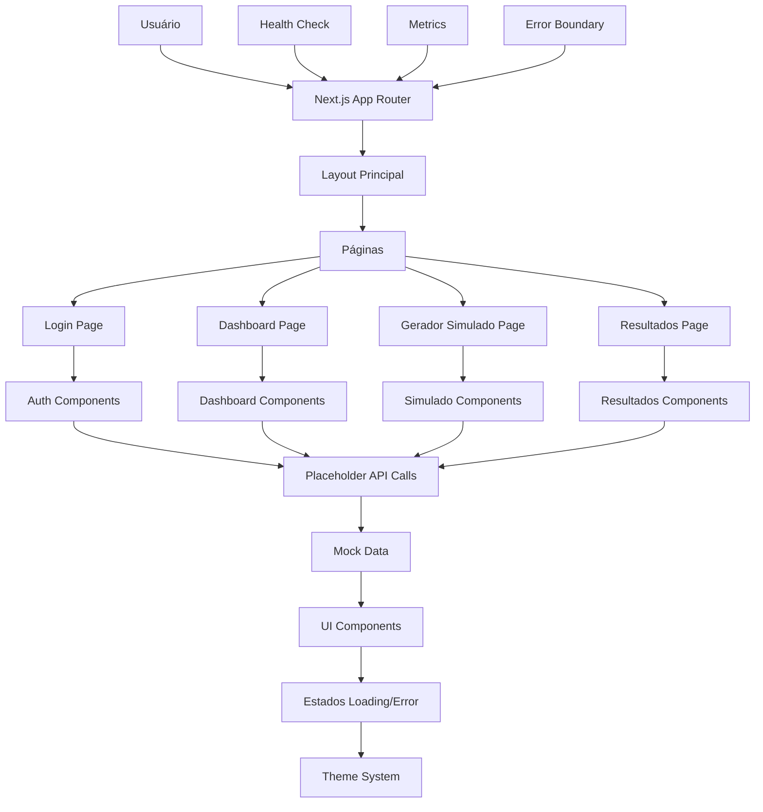

# ARCH_WEB-001: Protótipo Web — Shell do App (Next.js)

## 1. Diagrama (entrada→processamento→saída)



## 2. Pastas/arquivos a criar

```
/web-001/
├── src/
│   ├── app/
│   │   ├── layout.tsx
│   │   ├── page.tsx
│   │   ├── loading.tsx
│   │   ├── error.tsx
│   │   ├── not-found.tsx
│   │   ├── globals.css
│   │   ├── login/
│   │   │   ├── page.tsx
│   │   │   └── loading.tsx
│   │   ├── dashboard/
│   │   │   ├── page.tsx
│   │   │   └── loading.tsx
│   │   ├── gerador-simulado/
│   │   │   ├── page.tsx
│   │   │   └── loading.tsx
│   │   └── resultados/
│   │       ├── page.tsx
│   │       └── loading.tsx
│   ├── components/
│   │   ├── ui/
│   │   │   ├── button.tsx
│   │   │   ├── input.tsx
│   │   │   ├── card.tsx
│   │   │   ├── modal.tsx
│   │   │   ├── spinner.tsx
│   │   │   └── alert.tsx
│   │   ├── layout/
│   │   │   ├── header.tsx
│   │   │   ├── footer.tsx
│   │   │   ├── sidebar.tsx
│   │   │   └── navigation.tsx
│   │   ├── auth/
│   │   │   ├── login-form.tsx
│   │   │   ├── logout-button.tsx
│   │   │   └── auth-guard.tsx
│   │   ├── dashboard/
│   │   │   ├── stats-card.tsx
│   │   │   ├── recent-simulados.tsx
│   │   │   └── progress-chart.tsx
│   │   ├── simulado/
│   │   │   ├── simulado-form.tsx
│   │   │   ├── question-card.tsx
│   │   │   ├── timer.tsx
│   │   │   └── progress-bar.tsx
│   │   └── resultados/
│   │       ├── score-display.tsx
│   │       ├── question-review.tsx
│   │       └── performance-chart.tsx
│   ├── lib/
│   │   ├── utils.ts
│   │   ├── constants.ts
│   │   ├── types.ts
│   │   └── mock-data.ts
│   ├── hooks/
│   │   ├── use-auth.ts
│   │   ├── use-simulado.ts
│   │   └── use-local-storage.ts
│   ├── styles/
│   │   ├── globals.css
│   │   ├── components.css
│   │   └── themes.css
│   └── types/
│       ├── auth.ts
│       ├── simulado.ts
│       └── api.ts
├── public/
│   ├── images/
│   │   ├── logo.svg
│   │   ├── favicon.ico
│   │   └── placeholder.svg
│   └── icons/
│       ├── success.svg
│       ├── error.svg
│       └── warning.svg
├── docs/
│   ├── API.md
│   ├── COMPONENTS.md
│   └── DEPLOYMENT.md
├── tests/
│   ├── __mocks__/
│   │   └── mock-data.ts
│   ├── components/
│   │   ├── ui.test.tsx
│   │   ├── auth.test.tsx
│   │   └── dashboard.test.tsx
│   └── pages/
│       ├── login.test.tsx
│       ├── dashboard.test.tsx
│       └── simulado.test.tsx
├── next.config.js
├── tailwind.config.js
├── tsconfig.json
├── package.json
├── .env.example
├── .gitignore
├── README.md
└── Makefile
```

## 3. Contratos (schemas/DTOs) com exemplos

### Auth Types
```typescript
// types/auth.ts
export interface User {
  id: string;
  email: string;
  name: string;
  avatar?: string;
  createdAt: string;
  lastLogin?: string;
}

export interface LoginRequest {
  email: string;
  password: string;
}

export interface LoginResponse {
  user: User;
  token: string;
  expiresIn: number;
}

export interface AuthState {
  user: User | null;
  token: string | null;
  isAuthenticated: boolean;
  isLoading: boolean;
  error: string | null;
}
```

### Simulado Types
```typescript
// types/simulado.ts
export interface Simulado {
  id: string;
  title: string;
  description: string;
  banca: 'CESPE' | 'FGV' | 'VUNESP' | 'FCC';
  ano: number;
  topico: string;
  totalQuestions: number;
  timeLimit: number; // em minutos
  createdAt: string;
  status: 'draft' | 'active' | 'completed' | 'expired';
}

export interface Question {
  id: string;
  simuladoId: string;
  question: string;
  alternatives: {
    A: string;
    B: string;
    C: string;
    D: string;
    E: string;
  };
  correctAnswer: 'A' | 'B' | 'C' | 'D' | 'E';
  explanation?: string;
  difficulty: 'easy' | 'medium' | 'hard';
  topic: string;
}

export interface SimuladoResponse {
  questionId: string;
  selectedAnswer: 'A' | 'B' | 'C' | 'D' | 'E';
  timeSpent: number; // em segundos
  isCorrect: boolean;
}

export interface SimuladoResult {
  simuladoId: string;
  userId: string;
  score: number;
  totalQuestions: number;
  correctAnswers: number;
  timeSpent: number;
  responses: SimuladoResponse[];
  completedAt: string;
}
```

### API Types
```typescript
// types/api.ts
export interface ApiResponse<T> {
  data: T;
  message: string;
  success: boolean;
  timestamp: string;
}

export interface ApiError {
  code: string;
  message: string;
  details?: Record<string, any>;
  timestamp: string;
}

export interface PaginatedResponse<T> {
  data: T[];
  pagination: {
    page: number;
    limit: number;
    total: number;
    totalPages: number;
  };
}

// Mock API endpoints
export interface MockApiEndpoints {
  '/api/auth/login': {
    POST: {
      request: LoginRequest;
      response: ApiResponse<LoginResponse>;
    };
  };
  '/api/simulados': {
    GET: {
      response: ApiResponse<PaginatedResponse<Simulado>>;
    };
    POST: {
      request: Omit<Simulado, 'id' | 'createdAt'>;
      response: ApiResponse<Simulado>;
    };
  };
  '/api/simulados/[id]/questions': {
    GET: {
      response: ApiResponse<Question[]>;
    };
  };
  '/api/simulados/[id]/submit': {
    POST: {
      request: {
        responses: SimuladoResponse[];
        timeSpent: number;
      };
      response: ApiResponse<SimuladoResult>;
    };
  };
}
```

## 4. Decisões/Trade-offs

### **Framework e Tecnologias**
- **Next.js 14+ App Router**: Framework moderno com SSR/SSG
- **Trade-off**: Complexidade vs Performance
- **Decisão**: Next.js para SEO e performance, App Router para estrutura moderna

### **Styling**
- **Tailwind CSS**: Utility-first CSS framework
- **Trade-off**: Bundle size vs Developer experience
- **Decisão**: Tailwind para rapidez de desenvolvimento e consistência

### **State Management**
- **React Context + useReducer**: Estado local simples
- **Trade-off**: Simplicidade vs Escalabilidade
- **Decisão**: Context para MVP, migração para Zustand/Redux futura

### **API Integration**
- **Mock Data**: Dados simulados para desenvolvimento
- **Trade-off**: Realismo vs Velocidade
- **Decisão**: Mock data para MVP, integração real em sprints futuras

### **Authentication**
- **JWT Token**: Autenticação stateless
- **Trade-off**: Segurança vs Simplicidade
- **Decisão**: JWT para MVP, OAuth2 em produção

### **Error Handling**
- **Error Boundaries**: Captura de erros React
- **Trade-off**: Robustez vs Complexidade
- **Decisão**: Error boundaries para UX, logging para debugging

### **Testing**
- **Jest + React Testing Library**: Testes unitários
- **Trade-off**: Cobertura vs Velocidade
- **Decisão**: Testes básicos para MVP, cobertura completa futura

### **Deployment**
- **Vercel**: Deploy automático
- **Trade-off**: Vendor lock-in vs Simplicidade
- **Decisão**: Vercel para MVP, multi-cloud futura

## 5. Checklist por etapas (P/M/G) e Riscos & Mitigações

### **Setup Inicial (P)**
- [ ] Configurar Next.js 14+ com App Router
- [ ] Configurar Tailwind CSS
- [ ] Configurar TypeScript
- [ ] Configurar ESLint + Prettier
- [ ] Configurar estrutura de pastas

**Riscos:**
- **Configuração complexa**: Documentação clara e scripts automatizados
- **Dependências conflitantes**: Lock de versões e testes de compatibilidade

**Mitigações:**
- Documentação passo-a-passo
- Scripts de setup automatizados
- Testes de integração contínua

### **Layout e Navegação (P)**
- [ ] Implementar layout principal
- [ ] Implementar header com navegação
- [ ] Implementar footer
- [ ] Implementar sidebar (dashboard)
- [ ] Configurar roteamento

**Riscos:**
- **Navegação confusa**: UX testing e feedback
- **Layout responsivo**: Testes em múltiplos dispositivos

**Mitigações:**
- Protótipos de navegação
- Testes de responsividade
- Feedback de usuários

### **Páginas Principais (M)**
- [ ] Implementar página de login
- [ ] Implementar dashboard
- [ ] Implementar gerador de simulado
- [ ] Implementar página de resultados
- [ ] Implementar estados de loading/error

**Riscos:**
- **Performance lenta**: Lazy loading e otimizações
- **UX inconsistente**: Design system e componentes reutilizáveis

**Mitigações:**
- Code splitting
- Component library
- Performance monitoring

### **Componentes UI (M)**
- [ ] Implementar componentes base (Button, Input, Card)
- [ ] Implementar componentes de layout
- [ ] Implementar componentes de auth
- [ ] Implementar componentes de dashboard
- [ ] Implementar componentes de simulado

**Riscos:**
- **Reutilização baixa**: Design system consistente
- **Acessibilidade**: Testes de acessibilidade

**Mitigações:**
- Storybook para documentação
- Testes de acessibilidade
- Guidelines de design

### **Estado e Hooks (M)**
- [ ] Implementar contexto de autenticação
- [ ] Implementar hooks customizados
- [ ] Implementar persistência local
- [ ] Implementar error boundaries

**Riscos:**
- **Estado inconsistente**: Validação e normalização
- **Memory leaks**: Cleanup adequado de listeners

**Mitigações:**
- Validação de estado
- Profiling de memória
- Testes de integração

### **Mock Data e APIs (G)**
- [ ] Implementar mock data
- [ ] Implementar API client
- [ ] Implementar interceptors
- [ ] Implementar error handling

**Riscos:**
- **Dados irreais**: Validação de schemas
- **APIs inconsistentes**: Contratos bem definidos

**Mitigações:**
- Schema validation
- API documentation
- Contract testing

### **Tema e Estilização (G)**
- [ ] Implementar sistema de temas
- [ ] Implementar variáveis CSS
- [ ] Implementar modo escuro/claro
- [ ] Implementar responsividade

**Riscos:**
- **Inconsistência visual**: Design tokens
- **Performance CSS**: Otimização de bundles

**Mitigações:**
- Design system
- CSS optimization
- Visual regression testing

### **Testes e Qualidade (G)**
- [ ] Configurar Jest + RTL
- [ ] Implementar testes unitários
- [ ] Implementar testes de integração
- [ ] Configurar coverage

**Riscos:**
- **Cobertura baixa**: Metas de cobertura
- **Testes lentos**: Paralelização e otimização

**Mitigações:**
- Coverage thresholds
- Test optimization
- CI/CD integration

### **Deploy e Monitoramento (G)**
- [ ] Configurar Vercel
- [ ] Configurar domínio
- [ ] Implementar analytics
- [ ] Configurar error tracking

**Riscos:**
- **Deploy falha**: Rollback automático
- **Performance degradada**: Monitoring proativo

**Mitigações:**
- Automated rollback
- Performance monitoring
- Error tracking

---

**Este documento define a arquitetura completa do protótipo web WEB-001, incluindo estrutura, contratos, decisões técnicas e plano de implementação com mitigação de riscos.**
