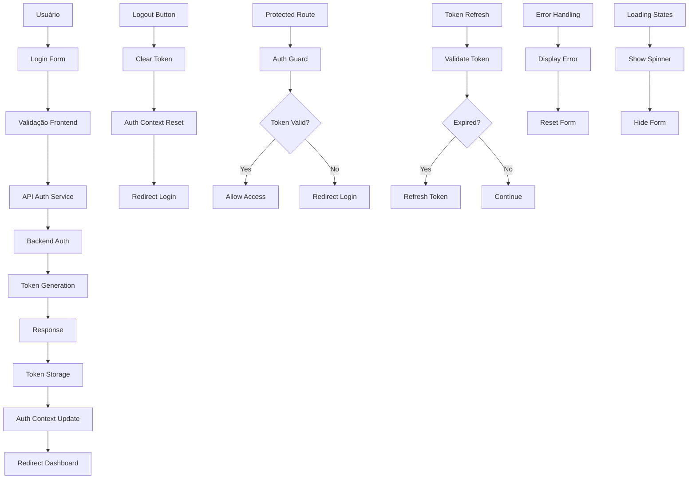

# ARCH_WEB-002: Autenticação Simples (E-mail/Senha)

## 1. Diagrama (entrada→processamento→saída)



## 2. Pastas/arquivos a criar

```
/web-002/
├── src/
│   ├── components/
│   │   ├── auth/
│   │   │   ├── login-form.tsx
│   │   │   ├── logout-button.tsx
│   │   │   ├── auth-guard.tsx
│   │   │   ├── protected-route.tsx
│   │   │   ├── auth-provider.tsx
│   │   │   └── password-input.tsx
│   │   ├── ui/
│   │   │   ├── button.tsx
│   │   │   ├── input.tsx
│   │   │   ├── alert.tsx
│   │   │   ├── spinner.tsx
│   │   │   └── form.tsx
│   │   └── layout/
│   │       ├── header.tsx
│   │       └── navigation.tsx
│   ├── hooks/
│   │   ├── use-auth.ts
│   │   ├── use-login.ts
│   │   ├── use-logout.ts
│   │   └── use-token.ts
│   ├── services/
│   │   ├── auth-service.ts
│   │   ├── token-service.ts
│   │   ├── api-client.ts
│   │   └── storage-service.ts
│   ├── utils/
│   │   ├── validation.ts
│   │   ├── constants.ts
│   │   ├── helpers.ts
│   │   └── errors.ts
│   ├── types/
│   │   ├── auth.ts
│   │   ├── api.ts
│   │   └── user.ts
│   ├── pages/
│   │   ├── login/
│   │   │   ├── index.tsx
│   │   │   └── loading.tsx
│   │   ├── dashboard/
│   │   │   └── index.tsx
│   │   └── _app.tsx
│   └── contexts/
│       ├── auth-context.tsx
│       └── auth-provider.tsx
├── tests/
│   ├── components/
│   │   ├── auth/
│   │   │   ├── login-form.test.tsx
│   │   │   ├── logout-button.test.tsx
│   │   │   └── auth-guard.test.tsx
│   │   └── ui/
│   │       └── form.test.tsx
│   ├── hooks/
│   │   ├── use-auth.test.ts
│   │   ├── use-login.test.ts
│   │   └── use-logout.test.ts
│   ├── services/
│   │   ├── auth-service.test.ts
│   │   ├── token-service.test.ts
│   │   └── storage-service.test.ts
│   └── utils/
│       ├── validation.test.ts
│       └── helpers.test.ts
├── docs/
│   ├── AUTH_FLOW.md
│   ├── API_CONTRACTS.md
│   └── SECURITY.md
├── .env.example
├── package.json
└── README.md
```

## 3. Contratos (schemas/DTOs) com exemplos

### Auth Types
```typescript
// types/auth.ts
export interface User {
  id: string;
  email: string;
  name: string;
  avatar?: string;
  createdAt: string;
  lastLogin?: string;
  isActive: boolean;
}

export interface LoginRequest {
  email: string;
  password: string;
  rememberMe?: boolean;
}

export interface LoginResponse {
  user: User;
  token: string;
  refreshToken: string;
  expiresIn: number;
  tokenType: 'Bearer';
}

export interface LogoutRequest {
  token: string;
}

export interface LogoutResponse {
  message: string;
  success: boolean;
}

export interface RefreshTokenRequest {
  refreshToken: string;
}

export interface RefreshTokenResponse {
  token: string;
  refreshToken: string;
  expiresIn: number;
}

export interface AuthState {
  user: User | null;
  token: string | null;
  refreshToken: string | null;
  isAuthenticated: boolean;
  isLoading: boolean;
  error: string | null;
  lastActivity: number;
}

export interface AuthContextType {
  state: AuthState;
  login: (credentials: LoginRequest) => Promise<void>;
  logout: () => Promise<void>;
  refreshToken: () => Promise<void>;
  clearError: () => void;
  updateUser: (user: Partial<User>) => void;
}
```

### API Types
```typescript
// types/api.ts
export interface ApiResponse<T> {
  data: T;
  message: string;
  success: boolean;
  timestamp: string;
}

export interface ApiError {
  code: string;
  message: string;
  details?: Record<string, any>;
  timestamp: string;
}

export interface ValidationError {
  field: string;
  message: string;
  code: string;
}

export interface AuthError extends ApiError {
  code: 'INVALID_CREDENTIALS' | 'ACCOUNT_LOCKED' | 'TOKEN_EXPIRED' | 'TOKEN_INVALID';
}
```

### User Types
```typescript
// types/user.ts
export interface UserProfile {
  id: string;
  email: string;
  name: string;
  avatar?: string;
  preferences: UserPreferences;
  statistics: UserStatistics;
  createdAt: string;
  updatedAt: string;
}

export interface UserPreferences {
  theme: 'light' | 'dark' | 'auto';
  language: string;
  notifications: {
    email: boolean;
    push: boolean;
    sms: boolean;
  };
}

export interface UserStatistics {
  totalSimulados: number;
  totalQuestions: number;
  averageScore: number;
  studyTime: number;
  lastActivity: string;
}
```

## 4. Decisões/Trade-offs

### **Autenticação**
- **JWT vs Session**: JWT para stateless, escalabilidade
- **Trade-off**: Segurança vs Simplicidade
- **Decisão**: JWT com refresh token para balance

### **Armazenamento de Token**
- **LocalStorage vs SessionStorage vs Cookies**: LocalStorage para persistência
- **Trade-off**: Segurança vs UX
- **Decisão**: LocalStorage com HttpOnly cookies em produção

### **Validação**
- **Frontend vs Backend**: Validação dupla para UX e segurança
- **Trade-off**: Performance vs Robustez
- **Decisão**: Validação frontend para UX, backend para segurança

### **Error Handling**
- **Global vs Component**: Error boundary global com tratamento local
- **Trade-off**: Consistência vs Flexibilidade
- **Decisão**: Error boundary global com tratamento específico

### **State Management**
- **Context vs Redux**: Context para simplicidade
- **Trade-off**: Complexidade vs Funcionalidade
- **Decisão**: Context com useReducer para MVP

### **Token Refresh**
- **Automático vs Manual**: Refresh automático em background
- **Trade-off**: UX vs Complexidade
- **Decisão**: Refresh automático com fallback manual

### **Security**
- **HTTPS vs HTTP**: HTTPS obrigatório em produção
- **Trade-off**: Segurança vs Desenvolvimento
- **Decisão**: HTTPS em produção, HTTP em desenvolvimento

### **Password Policy**
- **Simples vs Complexa**: Política básica para MVP
- **Trade-off**: Segurança vs UX
- **Decisão**: Política básica com validação mínima

## 5. Checklist por etapas (P/M/G) e Riscos & Mitigações

### **Setup Inicial (P)**
- [ ] Configurar estrutura de pastas
- [ ] Configurar TypeScript types
- [ ] Configurar constantes de auth
- [ ] Configurar variáveis de ambiente

**Riscos:**
- **Configuração complexa**: Documentação clara e scripts
- **Dependências conflitantes**: Lock de versões

**Mitigações:**
- Documentação passo-a-passo
- Scripts de setup automatizados
- Testes de configuração

### **Auth Service (P)**
- [ ] Implementar AuthService
- [ ] Implementar TokenService
- [ ] Implementar StorageService
- [ ] Implementar API client

**Riscos:**
- **Token inválido**: Validação rigorosa
- **Storage corrompido**: Fallback para login

**Mitigações:**
- Validação de token
- Limpeza de storage
- Error handling robusto

### **Auth Context (M)**
- [ ] Implementar AuthContext
- [ ] Implementar AuthProvider
- [ ] Implementar useAuth hook
- [ ] Implementar state management

**Riscos:**
- **Estado inconsistente**: Validação de estado
- **Memory leaks**: Cleanup adequado

**Mitigações:**
- Validação de estado
- Cleanup de listeners
- Profiling de memória

### **Login Form (M)**
- [ ] Implementar LoginForm
- [ ] Implementar validação
- [ ] Implementar error handling
- [ ] Implementar loading states

**Riscos:**
- **Validação inadequada**: Validação dupla
- **UX confusa**: Feedback claro

**Mitigações:**
- Validação frontend/backend
- Mensagens de erro claras
- Loading states visuais

### **Auth Guard (M)**
- [ ] Implementar AuthGuard
- [ ] Implementar ProtectedRoute
- [ ] Implementar redirect logic
- [ ] Implementar token validation

**Riscos:**
- **Bypass de proteção**: Validação rigorosa
- **Redirect loops**: Lógica clara

**Mitigações:**
- Validação de token
- Lógica de redirect testada
- Error boundaries

### **Logout Flow (G)**
- [ ] Implementar LogoutButton
- [ ] Implementar logout logic
- [ ] Implementar cleanup
- [ ] Implementar redirect

**Riscos:**
- **Logout incompleto**: Cleanup rigoroso
- **Estado residual**: Reset completo

**Mitigações:**
- Cleanup de todos os dados
- Reset de estado
- Validação de logout

### **Token Refresh (G)**
- [ ] Implementar refresh logic
- [ ] Implementar background refresh
- [ ] Implementar error handling
- [ ] Implementar fallback

**Riscos:**
- **Refresh falha**: Fallback para login
- **Token expirado**: Validação proativa

**Mitigações:**
- Fallback para login
- Validação proativa
- Error handling robusto

### **Error Handling (G)**
- [ ] Implementar error boundaries
- [ ] Implementar error types
- [ ] Implementar error messages
- [ ] Implementar error recovery

**Riscos:**
- **Erros não tratados**: Error boundaries
- **UX ruim**: Mensagens claras

**Mitigações:**
- Error boundaries globais
- Mensagens de erro claras
- Recovery automático

### **Testing (G)**
- [ ] Implementar testes unitários
- [ ] Implementar testes de integração
- [ ] Implementar testes E2E
- [ ] Implementar mocks

**Riscos:**
- **Cobertura baixa**: Metas de cobertura
- **Testes lentos**: Otimização

**Mitigações:**
- Coverage thresholds
- Test optimization
- CI/CD integration

### **Security (G)**
- [ ] Implementar HTTPS
- [ ] Implementar CSP
- [ ] Implementar sanitização
- [ ] Implementar rate limiting

**Riscos:**
- **Vulnerabilidades**: Auditoria de segurança
- **Ataques**: Proteções adequadas

**Mitigações:**
- Security audit
- Penetration testing
- Security headers

---

**Este documento define a arquitetura completa do sistema de autenticação WEB-002, incluindo estrutura, contratos, decisões técnicas e plano de implementação com mitigação de riscos.**
