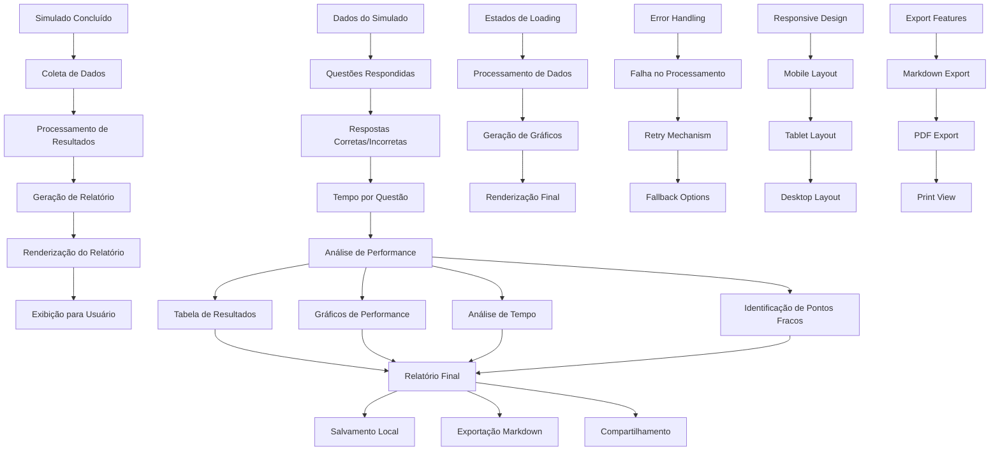

# ARCH_WEB-004: Relatório Pós-Simulado (Acertos/Erros/Tempo)

## 1. Diagrama (entrada→processamento→saída)



## 2. Pastas/arquivos a criar

```
/web-004/
├── src/
│   ├── components/
│   │   ├── results/
│   │   │   ├── results-summary.tsx
│   │   │   ├── results-table.tsx
│   │   │   ├── performance-chart.tsx
│   │   │   ├── time-analysis.tsx
│   │   │   ├── weak-points.tsx
│   │   │   ├── results-export.tsx
│   │   │   ├── results-share.tsx
│   │   │   └── results-print.tsx
│   │   ├── charts/
│   │   │   ├── pie-chart.tsx
│   │   │   ├── bar-chart.tsx
│   │   │   ├── line-chart.tsx
│   │   │   ├── radar-chart.tsx
│   │   │   └── progress-chart.tsx
│   │   ├── ui/
│   │   │   ├── button.tsx
│   │   │   ├── card.tsx
│   │   │   ├── table.tsx
│   │   │   ├── badge.tsx
│   │   │   ├── modal.tsx
│   │   │   ├── tooltip.tsx
│   │   │   ├── progress.tsx
│   │   │   └── alert.tsx
│   │   └── layout/
│   │       ├── header.tsx
│   │       ├── sidebar.tsx
│   │       └── footer.tsx
│   ├── hooks/
│   │   ├── use-results.ts
│   │   ├── use-charts.ts
│   │   ├── use-export.ts
│   │   ├── use-print.ts
│   │   └── use-analytics.ts
│   ├── services/
│   │   ├── results-service.ts
│   │   ├── analytics-service.ts
│   │   ├── export-service.ts
│   │   ├── storage-service.ts
│   │   └── share-service.ts
│   ├── utils/
│   │   ├── calculations.ts
│   │   ├── formatters.ts
│   │   ├── validators.ts
│   │   ├── export-utils.ts
│   │   └── chart-utils.ts
│   ├── types/
│   │   ├── results.ts
│   │   ├── analytics.ts
│   │   ├── charts.ts
│   │   └── export.ts
│   ├── pages/
│   │   ├── results/
│   │   │   ├── [id]/
│   │   │   │   ├── index.tsx
│   │   │   │   ├── print.tsx
│   │   │   │   └── export.tsx
│   │   │   └── loading.tsx
│   │   └── _app.tsx
│   └── contexts/
│       ├── results-context.tsx
│       └── results-provider.tsx
├── tests/
│   ├── components/
│   │   ├── results/
│   │   │   ├── results-summary.test.tsx
│   │   │   ├── results-table.test.tsx
│   │   │   ├── performance-chart.test.tsx
│   │   │   ├── time-analysis.test.tsx
│   │   │   ├── weak-points.test.tsx
│   │   │   └── results-export.test.tsx
│   │   └── charts/
│   │       ├── pie-chart.test.tsx
│   │       ├── bar-chart.test.tsx
│   │       └── line-chart.test.tsx
│   ├── hooks/
│   │   ├── use-results.test.ts
│   │   ├── use-charts.test.ts
│   │   └── use-export.test.ts
│   ├── services/
│   │   ├── results-service.test.ts
│   │   ├── analytics-service.test.ts
│   │   └── export-service.test.ts
│   └── utils/
│       ├── calculations.test.ts
│       ├── formatters.test.ts
│       └── export-utils.test.ts
├── docs/
│   ├── RESULTS_ANALYSIS.md
│   ├── EXPORT_FORMATS.md
│   └── CHART_SPECIFICATIONS.md
├── .env.example
├── package.json
└── README.md
```

## 3. Contratos (schemas/DTOs) com exemplos

### Results Types
```typescript
// types/results.ts
export interface SimuladoResults {
  id: string;
  simuladoId: string;
  userId: string;
  totalQuestions: number;
  correctAnswers: number;
  wrongAnswers: number;
  unansweredQuestions: number;
  score: number; // 0-100
  timeSpent: number; // em segundos
  averageTimePerQuestion: number; // em segundos
  submittedAt: string;
  completedAt: string;
  results: QuestionResult[];
  performance: PerformanceAnalysis;
  weakPoints: WeakPoint[];
  recommendations: Recommendation[];
}

export interface QuestionResult {
  questionId: string;
  question: string;
  selectedAnswer: 'A' | 'B' | 'C' | 'D' | 'E' | null;
  correctAnswer: 'A' | 'B' | 'C' | 'D' | 'E';
  isCorrect: boolean;
  timeSpent: number; // em segundos
  topic: string;
  difficulty: 'easy' | 'medium' | 'hard';
  order: number;
  explanation?: string;
}

export interface PerformanceAnalysis {
  overallScore: number;
  scoreByTopic: TopicScore[];
  scoreByDifficulty: DifficultyScore[];
  timeAnalysis: TimeAnalysis;
  accuracyRate: number;
  completionRate: number;
  improvementAreas: string[];
  strengths: string[];
}

export interface TopicScore {
  topic: string;
  totalQuestions: number;
  correctAnswers: number;
  score: number;
  averageTime: number;
  accuracy: number;
}

export interface DifficultyScore {
  difficulty: 'easy' | 'medium' | 'hard';
  totalQuestions: number;
  correctAnswers: number;
  score: number;
  averageTime: number;
  accuracy: number;
}

export interface TimeAnalysis {
  totalTime: number;
  averageTimePerQuestion: number;
  fastestQuestion: number;
  slowestQuestion: number;
  timeDistribution: TimeDistribution[];
  timeEfficiency: number; // 0-100
}

export interface TimeDistribution {
  range: string; // "0-30s", "30-60s", "60-120s", "120s+"
  count: number;
  percentage: number;
}

export interface WeakPoint {
  topic: string;
  difficulty: 'easy' | 'medium' | 'hard';
  accuracy: number;
  averageTime: number;
  questions: QuestionResult[];
  recommendations: string[];
}

export interface Recommendation {
  type: 'study' | 'practice' | 'time_management' | 'strategy';
  priority: 'high' | 'medium' | 'low';
  title: string;
  description: string;
  actionItems: string[];
  resources?: string[];
}
```

### Analytics Types
```typescript
// types/analytics.ts
export interface ChartData {
  labels: string[];
  datasets: ChartDataset[];
}

export interface ChartDataset {
  label: string;
  data: number[];
  backgroundColor?: string | string[];
  borderColor?: string | string[];
  borderWidth?: number;
  fill?: boolean;
}

export interface PieChartData {
  labels: string[];
  datasets: [{
    data: number[];
    backgroundColor: string[];
    borderColor: string[];
    borderWidth: number;
  }];
}

export interface BarChartData {
  labels: string[];
  datasets: [{
    label: string;
    data: number[];
    backgroundColor: string;
    borderColor: string;
    borderWidth: number;
  }];
}

export interface LineChartData {
  labels: string[];
  datasets: [{
    label: string;
    data: number[];
    borderColor: string;
    backgroundColor: string;
    fill: boolean;
    tension: number;
  }];
}

export interface RadarChartData {
  labels: string[];
  datasets: [{
    label: string;
    data: number[];
    backgroundColor: string;
    borderColor: string;
    borderWidth: number;
    pointBackgroundColor: string;
    pointBorderColor: string;
  }];
}
```

### Export Types
```typescript
// types/export.ts
export interface ExportOptions {
  format: 'markdown' | 'pdf' | 'json' | 'csv';
  includeCharts: boolean;
  includeDetails: boolean;
  includeRecommendations: boolean;
  includeWeakPoints: boolean;
  theme: 'light' | 'dark';
}

export interface ExportResult {
  success: boolean;
  data?: string | Blob;
  filename?: string;
  error?: string;
  size?: number;
}

export interface MarkdownExport {
  title: string;
  summary: string;
  results: string;
  charts: string[];
  analysis: string;
  recommendations: string;
  weakPoints: string;
  footer: string;
}

export interface PDFExport {
  title: string;
  summary: SummaryData;
  charts: ChartData[];
  tables: TableData[];
  analysis: AnalysisData;
  recommendations: Recommendation[];
  weakPoints: WeakPoint[];
  metadata: ExportMetadata;
}

export interface ExportMetadata {
  generatedAt: string;
  simuladoId: string;
  userId: string;
  version: string;
  totalPages: number;
}
```

## 4. Decisões/Trade-offs

### **Renderização de Relatórios**
- **Client-side vs Server-side**: Client-side para melhor UX
- **Trade-off**: Performance vs Flexibilidade
- **Decisão**: Client-side com cache local

### **Armazenamento de Dados**
- **Local vs Global**: Local storage para rascunhos
- **Trade-off**: Simplicidade vs Sincronização
- **Decisão**: Local storage com backup opcional

### **Geração de Gráficos**
- **Chart.js vs D3.js**: Chart.js para simplicidade
- **Trade-off**: Funcionalidade vs Complexidade
- **Decisão**: Chart.js com customizações

### **Exportação**
- **Múltiplos formatos vs Simplicidade**: Múltiplos formatos
- **Trade-off**: Flexibilidade vs Manutenção
- **Decisão**: Markdown + PDF + JSON

### **Performance**
- **Lazy loading vs Eager loading**: Lazy loading para gráficos
- **Trade-off**: UX vs Performance
- **Decisão**: Lazy loading com skeleton

### **Responsividade**
- **Mobile-first vs Desktop-first**: Mobile-first
- **Trade-off**: Desenvolvimento vs Acessibilidade
- **Decisão**: Mobile-first com breakpoints

### **Caching**
- **Memory vs LocalStorage**: LocalStorage para persistência
- **Trade-off**: Performance vs Persistência
- **Decisão**: LocalStorage com TTL

### **Error Handling**
- **Global vs Component**: Error boundary global
- **Trade-off**: Consistência vs Flexibilidade
- **Decisão**: Error boundary com fallbacks

## 5. Checklist por etapas (P/M/G) e Riscos & Mitigações

### **Setup Inicial (P)**
- [ ] Configurar estrutura de pastas
- [ ] Configurar TypeScript types
- [ ] Configurar bibliotecas de gráficos
- [ ] Configurar variáveis de ambiente

**Riscos:**
- **Dependências pesadas**: Chart.js pode impactar bundle
- **Configuração complexa**: Múltiplas bibliotecas

**Mitigações:**
- Lazy loading de bibliotecas
- Tree shaking para otimização
- Documentação clara

### **Componentes de Resultados (P)**
- [ ] Implementar ResultsSummary
- [ ] Implementar ResultsTable
- [ ] Implementar PerformanceChart
- [ ] Implementar TimeAnalysis
- [ ] Implementar WeakPoints

**Riscos:**
- **Performance lenta**: Muitos dados para renderizar
- **UX confusa**: Informações demais

**Mitigações:**
- Virtualização de tabelas
- Paginação de dados
- Filtros e busca

### **Gráficos e Visualizações (M)**
- [ ] Implementar PieChart
- [ ] Implementar BarChart
- [ ] Implementar LineChart
- [ ] Implementar RadarChart
- [ ] Implementar ProgressChart

**Riscos:**
- **Renderização lenta**: Gráficos complexos
- **Responsividade**: Gráficos em mobile

**Mitigações:**
- Lazy loading de gráficos
- Responsive charts
- Fallbacks para mobile

### **Análise de Dados (M)**
- [ ] Implementar cálculos de performance
- [ ] Implementar análise de tempo
- [ ] Implementar identificação de pontos fracos
- [ ] Implementar recomendações

**Riscos:**
- **Cálculos incorretos**: Lógica complexa
- **Performance**: Processamento pesado

**Mitigações:**
- Testes unitários rigorosos
- Web Workers para cálculos
- Cache de resultados

### **Exportação (M)**
- [ ] Implementar exportação Markdown
- [ ] Implementar exportação PDF
- [ ] Implementar exportação JSON
- [ ] Implementar exportação CSV

**Riscos:**
- **Formatação**: Diferentes formatos
- **Performance**: Geração de arquivos

**Mitigações:**
- Templates bem definidos
- Geração assíncrona
- Progress indicators

### **Salvamento Local (G)**
- [ ] Implementar localStorage
- [ ] Implementar rascunhos
- [ ] Implementar backup
- [ ] Implementar sincronização

**Riscos:**
- **Limite de storage**: localStorage limitado
- **Sincronização**: Dados inconsistentes

**Mitigações:**
- Compressão de dados
- Versionamento de dados
- Validação de integridade

### **Responsividade (G)**
- [ ] Implementar mobile layout
- [ ] Implementar tablet layout
- [ ] Implementar desktop layout
- [ ] Implementar print styles

**Riscos:**
- **Layout quebrado**: Gráficos em mobile
- **Performance**: Muitos breakpoints

**Mitigações:**
- Testes em múltiplos dispositivos
- Gráficos responsivos
- Print-friendly layouts

### **Testing (G)**
- [ ] Implementar testes unitários
- [ ] Implementar testes de integração
- [ ] Implementar testes E2E
- [ ] Implementar testes de performance

**Riscos:**
- **Cobertura baixa**: Componentes complexos
- **Testes lentos**: Gráficos e cálculos

**Mitigações:**
- Coverage thresholds
- Mock de bibliotecas
- Testes paralelos

### **Performance (G)**
- [ ] Implementar lazy loading
- [ ] Implementar code splitting
- [ ] Implementar caching
- [ ] Implementar optimization

**Riscos:**
- **Bundle size**: Bibliotecas pesadas
- **Memory usage**: Muitos dados

**Mitigações:**
- Dynamic imports
- Memory management
- Performance monitoring

---

**Este documento define a arquitetura completa do relatório pós-simulado WEB-004, incluindo estrutura, contratos, decisões técnicas e plano de implementação com mitigação de riscos.**
